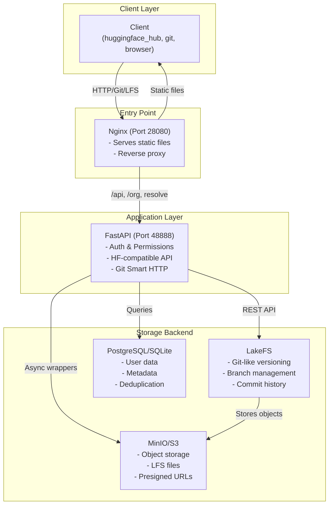
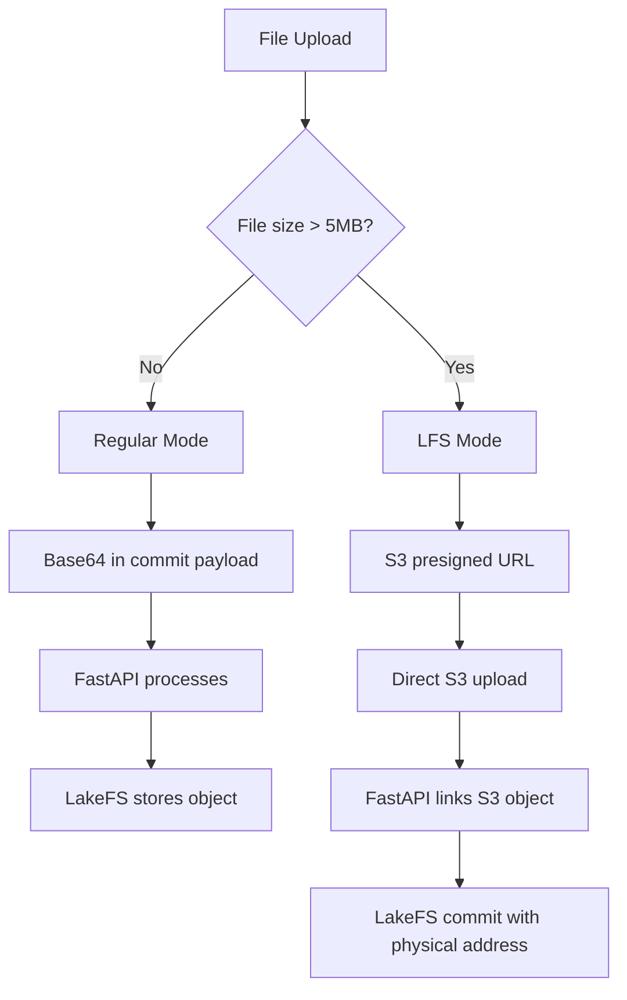
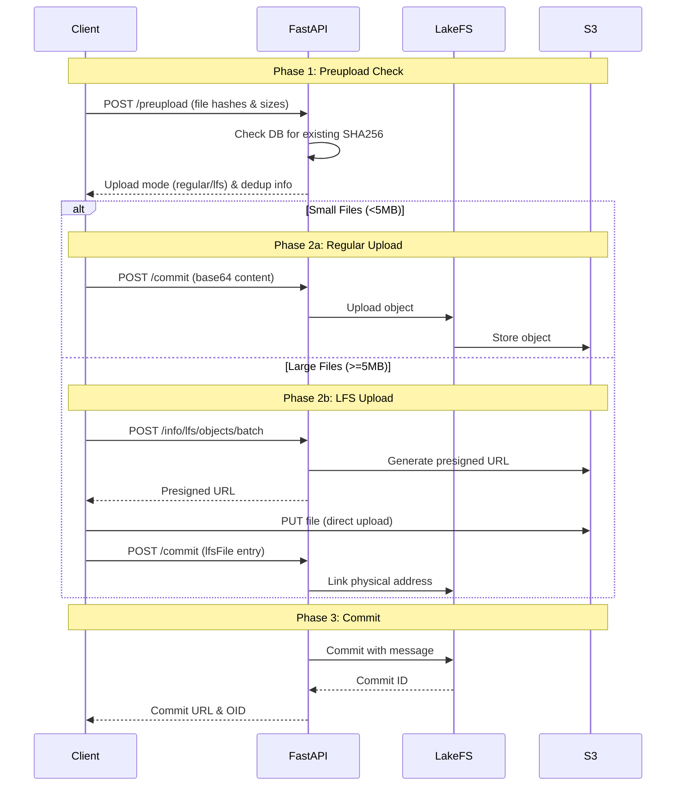
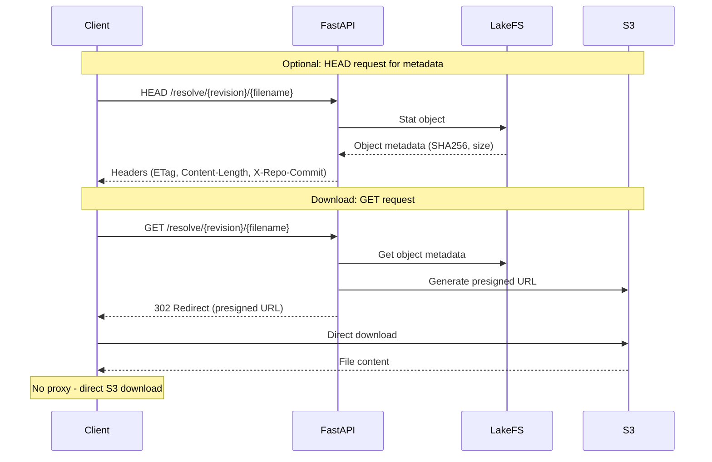
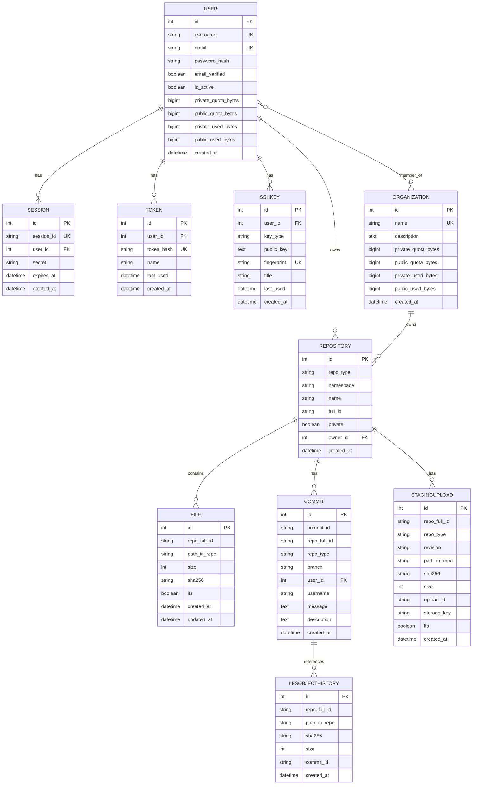

# Kohaku Hub API Documentation

*Last Updated: January 2025*

This document explains how Kohaku Hub's API works, the data flow, and key endpoints.

## System Architecture



## Core Concepts

### File Size Thresholds



**Note:** The LFS threshold is configurable via `KOHAKU_HUB_LFS_THRESHOLD_BYTES` (default: 5MB = 5,242,880 bytes).

### Storage Layout

```
S3 Bucket Structure:

s3://hub-storage/
  │
  ├── hf-model-org-repo/        ← LakeFS managed repository
  │   └── main/                 ← Branch
  │       ├── config.json
  │       └── model.safetensors
  │
  └── lfs/                      ← LFS objects (content-addressable)
      └── ab/                   ← First 2 chars of SHA256
          └── cd/               ← Next 2 chars
              └── abcd1234...   ← Full SHA256 hash
```

## Git Clone Support

### Overview

KohakuHub supports native Git clone operations using **pure Python implementation** (no pygit2/libgit2).

**Git URL Format:**
```
http://hub.example.com/{namespace}/{repo-name}.git
```

**Git Endpoints:**
- `GET /{namespace}/{name}.git/info/refs?service=git-upload-pack` - Service advertisement
- `POST /{namespace}/{name}.git/git-upload-pack` - Clone/fetch/pull
- `GET /{namespace}/{name}.git/HEAD` - Get HEAD reference
- `POST /{namespace}/{name}.git/git-receive-pack` - Push (in progress)

### LFS Integration

**Automatic LFS Pointers:**
- Files **<1MB**: Included in Git pack as regular blobs
- Files **>=1MB**: Converted to LFS pointers (100-byte text files)

**LFS Pointer Format:**
```
version https://git-lfs.github.com/spec/v1
oid sha256:abc123...
size 10737418240
```

**Client Workflow:**
```bash
# 1. Clone (gets pointers for large files)
git clone http://hub.example.com/org/repo.git

# 2. Download large files via LFS
cd repo
git lfs install
git lfs pull  # Uses existing /info/lfs/ endpoints
```

**Benefits:**
- Fast clones (only metadata + small files)
- No memory issues (LFS pointers are tiny)
- Leverages existing HuggingFace LFS infrastructure
- Pure Python (no native dependencies)

See [Git.md](./Git.md) for complete Git clone documentation and implementation details.

---

## Upload Workflow

### Overview



### Step 1: Preupload Check

**Purpose**: Determine upload mode and check for duplicates

**Endpoint**: `POST /api/{repo_type}s/{repo_id}/preupload/{revision}`

**Request**:
```json
{
  "files": [
    {
      "path": "config.json",
      "size": 1024,
      "sha256": "abc123..."
    },
    {
      "path": "model.bin",
      "size": 52428800,
      "sha256": "def456..."
    }
  ]
}
```

**Response**:
```json
{
  "files": [
    {
      "path": "config.json",
      "uploadMode": "regular",
      "shouldIgnore": false
    },
    {
      "path": "model.bin",
      "uploadMode": "lfs",
      "shouldIgnore": true    // Already exists!
    }
  ]
}
```

**Decision Logic**:
```
For each file:
  1. Check size:
     - ≤ 5MB → "regular"
     - > 5MB → "lfs"

  2. Check if exists (deduplication):
     - Query DB for matching SHA256 + size
     - If match found → shouldIgnore: true
     - If no match → shouldIgnore: false
```

### Step 2a: Regular Upload (≤5MB)

Files are sent inline in the commit payload as base64.

```
┌────────┐                    ┌────────┐
│ Client │───── base64 ──────>│ Commit │
└────────┘    (embedded)      └────────┘
```

**No separate upload step needed** - proceed directly to Step 3.

### Step 2b: LFS Upload (>5MB)

#### Phase 1: Request Upload URLs

**Endpoint**: `POST /{repo_id}.git/info/lfs/objects/batch`

**Request**:
```json
{
  "operation": "upload",
  "transfers": ["basic", "multipart"],
  "objects": [
    {
      "oid": "sha256_hash",
      "size": 52428800
    }
  ]
}
```

**Response** (if file needs upload):
```json
{
  "transfer": "basic",
  "objects": [
    {
      "oid": "sha256_hash",
      "size": 52428800,
      "actions": {
        "upload": {
          "href": "https://s3.../presigned_url",
          "expires_at": "2025-10-02T00:00:00Z"
        }
      }
    }
  ]
}
```

**Response** (if file already exists):
```json
{
  "transfer": "basic",
  "objects": [
    {
      "oid": "sha256_hash",
      "size": 52428800
      // No "actions" field = already exists
    }
  ]
}
```

#### Phase 2: Upload to S3

```
┌────────┐                       ┌─────────┐
│ Client │---- PUT file -------->│   S3    │
└────────┘   (presigned URL)     └─────────┘
              Direct upload       lfs/ab/cd/
              (no proxy!)         abcd123...
```

**Key Point**: Client uploads directly to S3 using the presigned URL. Kohaku Hub server is NOT involved in data transfer.

### Step 3: Commit

**Purpose**: Atomically commit all changes to the repository

**Endpoint**: `POST /api/{repo_type}s/{repo_id}/commit/{revision}`

**Format**: NDJSON (Newline-Delimited JSON)

**Example Payload**:
```
{"key":"header","value":{"summary":"Add model files","description":"Initial upload"}}
{"key":"file","value":{"path":"config.json","content":"eyJtb2RlbCI6...","encoding":"base64"}}
{"key":"lfsFile","value":{"path":"model.bin","algo":"sha256","oid":"abc123...","size":52428800}}
{"key":"deletedFile","value":{"path":"old_config.json"}}
```

**Operation Types**:

| Key | Description | Usage |
|-----|-------------|-------|
| `header` | Commit metadata | Required, must be first line |
| `file` | Small file (inline base64) | For files ≤ 5MB |
| `lfsFile` | Large file (LFS reference) | For files > 5MB, already uploaded to S3 |
| `deletedFile` | Delete a single file | Remove file from repo |
| `deletedFolder` | Delete folder recursively | Remove all files in folder |
| `copyFile` | Copy file within repo | Duplicate file (deduplication-aware) |

**Response**:
```json
{
  "commitUrl": "https://hub.example.com/repo/commit/abc123",
  "commitOid": "abc123def456",
  "pullRequestUrl": null
}
```

**What Happens**:
```
1. Regular files:
   ┌─────────┐
   │ Decode  │ Base64 -> Binary
   └────┬────┘
        |
        v
   ┌─────────┐
   │ Upload  │ To LakeFS
   └────┬────┘
        |
        v
   ┌─────────┐
   │ Update  │ Database record
   └─────────┘

2. LFS files:
   ┌─────────┐
   │  Link   │ S3 physical address -> LakeFS
   └────┬────┘
        |
        v
   ┌─────────┐
   │ Update  │ Database record
   └─────────┘

3. Commit:
   ┌─────────┐
   │ LakeFS  │ Create commit with all changes
   └─────────┘
```

## Download Workflow



### Step 1: Get Metadata (HEAD)

**Endpoint**: `HEAD /{repo_id}/resolve/{revision}/{filename}`

**Response Headers**:
```
X-Repo-Commit: abc123def456
X-Linked-Etag: "sha256:abc123..."
X-Linked-Size: 52428800
ETag: "abc123..."
Content-Length: 52428800
Location: https://s3.../presigned_download_url
```

**Purpose**: Client checks if file needs re-download (by comparing ETag)

### Step 2: Download (GET)

**Endpoint**: `GET /{repo_id}/resolve/{revision}/{filename}`

**Response**: HTTP 302 Redirect

```
HTTP/1.1 302 Found
Location: https://s3.example.com/presigned_url?expires=...
X-Repo-Commit: abc123def456
X-Linked-Etag: "sha256:abc123..."
```

**Flow**:
```
┌────────┐                ┌──────────┐
│ Client │───── GET ─────>│  Kohaku  │
└────────┘                │    Hub   │
     ▲                    └─────┬────┘
     │                          │
     │   302 Redirect           │ Generate
     │   (presigned URL)        │ presigned
     │<─────────────────────────┘ URL
     │
     │    ┌──────────┐
     └───>│    S3    │
          │  Direct  │
          │ Download │
          └──────────┘
```

**Key Point**: Client downloads directly from S3. Kohaku Hub only provides the redirect URL.

## Repository Privacy & Filtering

KohakuHub respects repository privacy settings when listing repositories. The visibility of repositories depends on authentication:

### Privacy Rules

**For Unauthenticated Users:**
- Can only see **public** repositories

**For Authenticated Users:**
- Can see all **public** repositories
- Can see their **own private** repositories
- Can see **private repositories** in organizations they belong to

### List Repositories Endpoint

**Pattern**: `/api/{type}s` where type is `model`, `dataset`, or `space`

**Query Parameters:**
- `author`: Filter by author/namespace (username or organization)
- `limit`: Maximum results (default: 50, max: 1000)

**Examples:**
```bash
# List all public models
GET /api/models

# List models by author (respects privacy)
GET /api/models?author=my-org

# Authenticated user sees their private repos too
GET /api/models?author=my-org
Authorization: Bearer YOUR_TOKEN
```

### List User's All Repositories

**Endpoint**: `GET /api/users/{username}/repos`

Returns all repositories for a user/organization, grouped by type.

**Response:**
```json
{
  "models": [
    {"id": "user/model-1", "private": false, ...},
    {"id": "user/model-2", "private": true, ...}
  ],
  "datasets": [
    {"id": "user/dataset-1", "private": false, ...}
  ],
  "spaces": []
}
```

**Note**: Private repositories are only included if:
1. The requesting user is the owner, OR
2. The requesting user is a member of the organization

## Repository Management

### Create Repository

**Endpoint**: `POST /api/repos/create`

**Request**:
```json
{
  "type": "model",
  "name": "my-model",
  "organization": "my-org",
  "private": false
}
```

**What Happens**:
```
1. Check if exists
   └─ Query DB for repo

2. Create LakeFS repo
   └─ Repository: hf-model-my-org-my-model
   └─ Storage: s3://bucket/hf-model-my-org-my-model
   └─ Default branch: main

3. Record in DB
   └─ INSERT INTO repository (...)
```

**Response**:
```json
{
  "url": "https://hub.example.com/models/my-org/my-model",
  "repo_id": "my-org/my-model"
}
```

### List Repository Files

**Endpoint**: `GET /api/{repo_type}s/{repo_id}/tree/{revision}/{path}`

**Query Parameters**:
- `recursive`: List all files recursively (default: false)
- `expand`: Include LFS metadata (default: false)

**Response**:
```json
[
  {
    "type": "file",
    "oid": "abc123",
    "size": 1024,
    "path": "config.json"
  },
  {
    "type": "file",
    "oid": "def456",
    "size": 52428800,
    "path": "model.bin",
    "lfs": {
      "oid": "def456",
      "size": 52428800,
      "pointerSize": 134
    }
  },
  {
    "type": "directory",
    "oid": "",
    "size": 0,
    "path": "configs"
  }
]
```

### Delete Repository

**Endpoint**: `DELETE /api/repos/delete`

**Request**:
```json
{
  "type": "model",
  "name": "my-model",
  "organization": "my-org"
}
```

**What Happens**:
```
1. Delete from LakeFS
   └─ Remove repository metadata
   └─ (Objects remain in S3 for safety)

2. Delete from DB
   ├─ DELETE FROM file WHERE repo_full_id = ...
   ├─ DELETE FROM staging_upload WHERE repo_full_id = ...
   └─ DELETE FROM repository WHERE full_id = ...

3. Return success
```

## Database Schema



### Key Tables

**Repository Table** - Stores repository metadata:
- Unique constraint on `(repo_type, namespace, name)`
- Allows same `full_id` across different `repo_type`
- Example: `model:myorg/mymodel`, `dataset:myorg/mymodel`

**File Table** - Deduplication and metadata:
- Unique constraint on `(repo_full_id, path_in_repo)`
- `sha256` indexed for fast deduplication lookups
- `lfs` flag indicates if file uses LFS storage

**Commit Table** - User commit tracking:
- `commit_id` is LakeFS commit SHA
- Indexed by `(repo_full_id, branch)` for fast queries
- Denormalized `username` for performance

**LFSObjectHistory Table** - LFS garbage collection:
- Tracks which commits reference which LFS objects
- Enables preserving K versions of each file (default: 5)
- Used for auto-cleanup of old LFS objects

**StagingUpload Table** - Multipart upload tracking:
- Tracks ongoing multipart uploads
- Enables upload resume
- Cleans up failed uploads

## LakeFS Integration

### Repository Naming Convention

```
Pattern: {namespace}-{repo_type}-{org}-{name}

Examples:
  HuggingFace repo: "myorg/mymodel"
  LakeFS repo:      "hf-model-myorg-mymodel"
  
  HuggingFace repo: "johndoe/dataset"
  LakeFS repo:      "hf-dataset-johndoe-dataset"
```

### Key Operations

**All LakeFS operations use pure async REST API via httpx (no thread pools!):**

| Operation | LakeFS REST Endpoint | KohakuHub Method | Purpose |
|-----------|---------------------|------------------|---------|
| Create Repo | `POST /repositories` | `create_repository()` | Initialize new repository |
| Upload Small File | `POST /repositories/{repo}/branches/{branch}/objects` | `upload_object()` | Direct content upload |
| Link LFS File | `PUT /repositories/{repo}/branches/{branch}/staging/backing` | `link_physical_address()` | Link S3 object to LakeFS |
| Commit | `POST /repositories/{repo}/branches/{branch}/commits` | `commit()` | Create atomic commit |
| List Files | `GET /repositories/{repo}/refs/{ref}/objects/ls` | `list_objects()` | Browse repository |
| Get File Info | `GET /repositories/{repo}/refs/{ref}/objects/stat` | `stat_object()` | Get file metadata |
| Get File Content | `GET /repositories/{repo}/refs/{ref}/objects` | `get_object()` | Download file |
| Delete File | `DELETE /repositories/{repo}/branches/{branch}/objects` | `delete_object()` | Remove file |
| Create Branch | `POST /repositories/{repo}/branches` | `create_branch()` | Create new branch |
| Delete Branch | `DELETE /repositories/{repo}/branches/{branch}` | `delete_branch()` | Delete branch |
| Create Tag | `POST /repositories/{repo}/tags` | `create_tag()` | Create tag |
| Delete Tag | `DELETE /repositories/{repo}/tags/{tag}` | `delete_tag()` | Delete tag |
| Revert | `POST /repositories/{repo}/branches/{branch}/revert` | `revert_branch()` | Revert commit |
| Merge | `POST /repositories/{repo}/refs/{source}/merge/{dest}` | `merge_into_branch()` | Merge branches |
| Hard Reset | `PUT /repositories/{repo}/branches/{branch}/hard_reset` | `hard_reset_branch()` | Reset branch to commit |

### Physical Address Linking

```
When uploading LFS file:

1. Client uploads to S3:
   s3://bucket/lfs/ab/cd/abcd1234...

2. Kohaku Hub links to LakeFS:
   ┌──────────────────────────────────┐
   │ StagingMetadata                  │
   ├──────────────────────────────────┤
   │ physical_address:                │
   │   "s3://bucket/lfs/ab/cd/abc..." │
   │ checksum: "sha256:abc..."        │
   │ size_bytes: 52428800             │
   └──────────────────────────────────┘
              │
              ▼
   ┌──────────────────────────────────┐
   │ LakeFS: model.bin                │
   │ → Points to S3 object            │
   └──────────────────────────────────┘

3. On commit:
   LakeFS records this link in its metadata
```

## API Endpoint Summary

### Repository Operations

| Endpoint | Method | Auth | Description |
|----------|--------|------|-------------|
| `/api/repos/create` | POST | ✓ | Create new repository |
| `/api/repos/delete` | DELETE | ✓ | Delete repository |
| `/api/repos/move` | POST | ✓ | Move/rename repository |
| `/api/{type}s` | GET | ○ | List repositories (respects privacy) |
| `/api/{type}s/{id}` | GET | ○ | Get repo info |
| `/api/{type}s/{id}/tree/{rev}/{path}` | GET | ○ | List files |
| `/api/{type}s/{id}/revision/{rev}` | GET | ○ | Get revision info |
| `/api/{type}s/{id}/paths-info/{rev}` | POST | ○ | Get info for specific paths |
| `/api/users/{username}/repos` | GET | ○ | List all repos for a user/org (grouped by type) |

### File Operations

| Endpoint | Method | Auth | Description |
|----------|--------|------|-------------|
| `/api/{type}s/{id}/preupload/{rev}` | POST | ✓ | Check before upload |
| `/api/{type}s/{id}/commit/{rev}` | POST | ✓ | Atomic commit |
| `/{id}/resolve/{rev}/{file}` | GET | ○ | Download file |
| `/{id}/resolve/{rev}/{file}` | HEAD | ○ | Get file metadata |
| `/{type}s/{id}/resolve/{rev}/{file}` | GET | ○ | Download file (with type) |
| `/{type}s/{id}/resolve/{rev}/{file}` | HEAD | ○ | Get file metadata (with type) |

### LFS Operations

| Endpoint | Method | Auth | Description |
|----------|--------|------|-------------|
| `/{id}.git/info/lfs/objects/batch` | POST | ✓ | LFS batch API |
| `/api/{id}.git/info/lfs/verify` | POST | ✓ | Verify upload |

### Commit History

| Endpoint | Method | Auth | Description |
|----------|--------|------|-------------|
| `/{type}s/{namespace}/{name}/commits/{branch}` | GET | ○ | List commits on a branch with pagination |

### Branch and Tag Management

| Endpoint | Method | Auth | Description |
|----------|--------|------|-------------|
| `/{type}s/{namespace}/{name}/branch` | POST | ✓ | Create a new branch |
| `/{type}s/{namespace}/{name}/branch/{branch}` | DELETE | ✓ | Delete a branch |
| `/{type}s/{namespace}/{name}/tag` | POST | ✓ | Create a new tag |
| `/{type}s/{namespace}/{name}/tag/{tag}` | DELETE | ✓ | Delete a tag |

### Settings Management

| Endpoint | Method | Auth | Description |
|----------|--------|------|-------------|
| `/users/{username}/settings` | PUT | ✓ | Update user settings |
| `/organizations/{org_name}/settings` | PUT | ✓ | Update organization settings |
| `/{type}s/{namespace}/{name}/settings` | PUT | ✓ | Update repository settings (private, gated) |

### Authentication Operations

| Endpoint | Method | Auth | Description |
|----------|--------|------|-------------|
| `/api/auth/register` | POST | ✗ | Register new user |
| `/api/auth/login` | POST | ✗ | Login and create session |
| `/api/auth/logout` | POST | ✓ | Logout and destroy session |
| `/api/auth/verify-email` | GET | ✗ | Verify email with token |
| `/api/auth/me` | GET | ✓ | Get current user info |
| `/api/auth/tokens` | GET | ✓ | List user's API tokens |
| `/api/auth/tokens/create` | POST | ✓ | Create new API token |
| `/api/auth/tokens/{token_id}` | DELETE | ✓ | Revoke API token |

### Organization Operations

| Endpoint | Method | Auth | Description |
|----------|--------|------|-------------|
| `/org/create` | POST | ✓ | Create new organization |
| `/org/{org_name}` | GET | ✗ | Get organization details |
| `/org/{org_name}/members` | GET | ○ | List organization members |
| `/org/{org_name}/members` | POST | ✓ | Add member to organization |
| `/org/{org_name}/members/{username}` | DELETE | ✓ | Remove member from organization |
| `/org/{org_name}/members/{username}` | PUT | ✓ | Update member role |
| `/org/users/{username}/orgs` | GET | ✗ | List user's organizations |

### Utility Operations

| Endpoint | Method | Auth | Description |
|----------|--------|------|-------------|
| `/api/validate-yaml` | POST | ✗ | Validate YAML content |
| `/api/whoami-v2` | GET | ✓ | Get detailed current user info |
| `/api/version` | GET | ✗ | Get API version information |
| `/health` | GET | ✗ | Health check |
| `/` | GET | ✗ | API information |

**Auth Legend**:
- ✓ = Required
- ○ = Optional (public repos)
- ✗ = Not required

---

## Detailed Endpoint Documentation

### Commit History API

The commit history API allows you to retrieve the commit log for a specific branch in a repository.

**Endpoint**: `GET /{repo_type}s/{namespace}/{name}/commits/{branch}`

**Query Parameters**:
- `page`: Page number for pagination (default: 1)
- `limit`: Number of commits per page (default: 20)

**Example Request**:
```bash
GET /models/myorg/mymodel/commits/main?page=1&limit=20
```

**Response**:
```json
{
  "commits": [
    {
      "id": "abc123def456",
      "message": "Update model config",
      "author": "john@example.com",
      "committer": "john@example.com",
      "createdAt": "2025-10-05T12:00:00Z",
      "parents": ["parent123"]
    }
  ],
  "pagination": {
    "page": 1,
    "limit": 20,
    "total": 150,
    "hasMore": true
  }
}
```

### Branch and Tag Management

#### Create Branch

**Endpoint**: `POST /{repo_type}s/{namespace}/{name}/branch`

**Request**:
```json
{
  "branch": "feature-branch",
  "startPoint": "main"
}
```

**Response**:
```json
{
  "success": true,
  "branch": "feature-branch",
  "ref": "refs/heads/feature-branch"
}
```

#### Delete Branch

**Endpoint**: `DELETE /{repo_type}s/{namespace}/{name}/branch/{branch}`

**Example**: `DELETE /models/myorg/mymodel/branch/feature-branch`

**Response**:
```json
{
  "success": true,
  "deleted": "feature-branch"
}
```

**Note**: Cannot delete the default branch (usually `main`).

#### Create Tag

**Endpoint**: `POST /{repo_type}s/{namespace}/{name}/tag`

**Request**:
```json
{
  "tag": "v1.0.0",
  "ref": "main",
  "message": "Release version 1.0.0"
}
```

**Response**:
```json
{
  "success": true,
  "tag": "v1.0.0",
  "ref": "refs/tags/v1.0.0"
}
```

#### Delete Tag

**Endpoint**: `DELETE /{repo_type}s/{namespace}/{name}/tag/{tag}`

**Example**: `DELETE /models/myorg/mymodel/tag/v1.0.0`

**Response**:
```json
{
  "success": true,
  "deleted": "v1.0.0"
}
```

### Settings Management

#### Update User Settings

**Endpoint**: `PUT /users/{username}/settings`

**Request**:
```json
{
  "email": "newemail@example.com",
  "displayName": "John Doe",
  "bio": "ML Engineer",
  "website": "https://example.com"
}
```

**Response**:
```json
{
  "success": true,
  "user": {
    "username": "johndoe",
    "email": "newemail@example.com",
    "displayName": "John Doe"
  }
}
```

#### Update Organization Settings

**Endpoint**: `PUT /organizations/{org_name}/settings`

**Request**:
```json
{
  "displayName": "My Organization",
  "description": "Building amazing ML models",
  "website": "https://example.com",
  "avatar": "https://cdn.example.com/avatar.png"
}
```

**Response**:
```json
{
  "success": true,
  "organization": {
    "name": "my-org",
    "displayName": "My Organization",
    "description": "Building amazing ML models"
  }
}
```

#### Update Repository Settings

**Endpoint**: `PUT /{repo_type}s/{namespace}/{name}/settings`

**Request**:
```json
{
  "private": true,
  "gated": false,
  "description": "A state-of-the-art language model",
  "tags": ["nlp", "transformers", "llm"]
}
```

**Response**:
```json
{
  "success": true,
  "repository": {
    "id": "myorg/mymodel",
    "private": true,
    "gated": false,
    "description": "A state-of-the-art language model"
  }
}
```

**Privacy Options**:
- `private: false` - Public repository, visible to everyone
- `private: true` - Private repository, only visible to owner and organization members
- `gated: true` - Requires explicit permission to access (for controlled releases)

#### Move/Rename Repository

**Endpoint**: `POST /api/repos/move`

**Request**:
```json
{
  "fromRepo": {
    "type": "model",
    "namespace": "oldorg",
    "name": "oldname"
  },
  "toRepo": {
    "type": "model",
    "namespace": "neworg",
    "name": "newname"
  }
}
```

**Response**:
```json
{
  "success": true,
  "url": "https://hub.example.com/models/neworg/newname",
  "message": "Repository moved successfully"
}
```

**What Happens**:
1. Validates that source repository exists and user has permission
2. Checks that destination doesn't already exist
3. Updates LakeFS repository name
4. Updates all database records
5. Creates redirect from old URL to new URL

**Note**: This operation is atomic - either everything succeeds or everything rolls back.

### Version and Utility Endpoints

#### Get API Version

**Endpoint**: `GET /api/version`

**Response**:
```json
{
  "version": "1.0.0",
  "apiVersion": "v1",
  "lfsVersion": "2.0",
  "features": {
    "lfs": true,
    "multipart": true,
    "deduplication": true,
    "organizations": true
  },
  "limits": {
    "maxFileSize": 107374182400,
    "lfsThreshold": 10485760
  }
}
```

#### Validate YAML

**Endpoint**: `POST /api/validate-yaml`

**Request**:
```json
{
  "content": "model:\n  name: gpt-2\n  version: 1.0"
}
```

**Response** (if valid):
```json
{
  "valid": true,
  "parsed": {
    "model": {
      "name": "gpt-2",
      "version": "1.0"
    }
  }
}
```

**Response** (if invalid):
```json
{
  "valid": false,
  "error": "Invalid YAML syntax at line 2: unexpected character",
  "line": 2,
  "column": 10
}
```

**Use Case**: Validate README.md frontmatter, model card YAML, or configuration files before upload.

#### Get Detailed User Info (whoami-v2)

**Endpoint**: `GET /api/whoami-v2`

**Response**:
```json
{
  "type": "user",
  "id": "12345",
  "name": "johndoe",
  "fullname": "John Doe",
  "email": "john@example.com",
  "emailVerified": true,
  "canPay": true,
  "isPro": false,
  "periodEnd": null,
  "avatarUrl": "https://cdn.example.com/avatars/johndoe.png",
  "orgs": [
    {
      "name": "my-org",
      "fullname": "My Organization",
      "email": "contact@my-org.com",
      "avatarUrl": "https://cdn.example.com/orgs/my-org.png",
      "roleInOrg": "admin"
    }
  ],
  "auth": {
    "accessToken": {
      "displayName": "API Token",
      "role": "write"
    }
  }
}
```

**Compared to `/api/auth/me`**: This endpoint provides more detailed information including:
- Organization memberships with roles
- Token information
- Subscription/payment status
- Email verification status

## Content Deduplication

Kohaku Hub implements content-addressable storage for LFS files:

```
Same file uploaded to different repos:

Repo A: myorg/model-v1
  └─ model.bin (sha256: abc123...)

Repo B: myorg/model-v2
  └─ model.bin (sha256: abc123...)

S3 Storage:
  └─ lfs/ab/c1/abc123...  ← SINGLE COPY
         ▲          ▲
         │          │
    Repo A      Repo B
    (linked)    (linked)

Benefits:
  - Save storage space
  - Faster uploads (skip if exists)
  - Efficient for model variants
```

**Deduplication Points**:

1. **Preupload Check**: Query DB by SHA256
2. **LFS Batch API**: Check if OID exists
3. **Commit**: Link existing S3 object instead of uploading

## Error Handling

Kohaku Hub uses HuggingFace-compatible error headers:

```
HTTP Response Headers:
  X-Error-Code: RepoNotFound
  X-Error-Message: Repository 'org/repo' not found
```

**Error Codes**:

| Code | HTTP Status | Description |
|------|-------------|-------------|
| `RepoNotFound` | 404 | Repository doesn't exist |
| `RepoExists` | 400 | Repository already exists |
| `RevisionNotFound` | 404 | Branch/commit not found |
| `EntryNotFound` | 404 | File not found |
| `GatedRepo` | 403 | Need permission |
| `BadRequest` | 400 | Invalid request |
| `ServerError` | 500 | Internal error |

These error codes are parsed by `huggingface_hub` client to raise appropriate Python exceptions.

## Performance Considerations

### Upload Performance

```
Small Files (≤10MB):
  Client → FastAPI → LakeFS → S3
  (Proxied through server)

Large Files (>10MB):
  Client ─────────────────────→ S3
  (Direct upload, no proxy)
         ↓
  Kohaku Hub (only metadata link)
```

**Why this matters**: Large files bypass the application server entirely, allowing unlimited throughput limited only by client and S3 bandwidth.

### Download Performance

```
All Downloads:
  Client → Kohaku Hub → 302 Redirect → S3
                         (metadata)    (direct)
```

**Why this matters**: After initial redirect, all data transfer is direct from S3/CDN. Server only generates presigned URLs.

### Recommended S3 Providers

| Provider | Best For | Pricing Model | Notes |
|----------|----------|---------------|-------|
| Cloudflare R2 | High download | Free egress, $0.015/GB storage | Best for public datasets |
| Wasabi | Archive/backup | $6/TB/month, free egress* | *if download < storage |
| MinIO | Self-hosted | Free (your hardware/bandwidth) | Full control, privacy |
| AWS S3 | Enterprise | Pay per GB + egress | Most features, expensive egress |
| Backblaze B2 | Budget | $6/TB storage, $0.01/GB egress | Good for mixed workloads |

**Recommendation for KohakuHub:**
- **Development**: MinIO (included in docker-compose)
- **Public Hub**: Cloudflare R2 (free egress saves costs)
- **Private/Enterprise**: Self-hosted MinIO or AWS S3 with VPC endpoints
