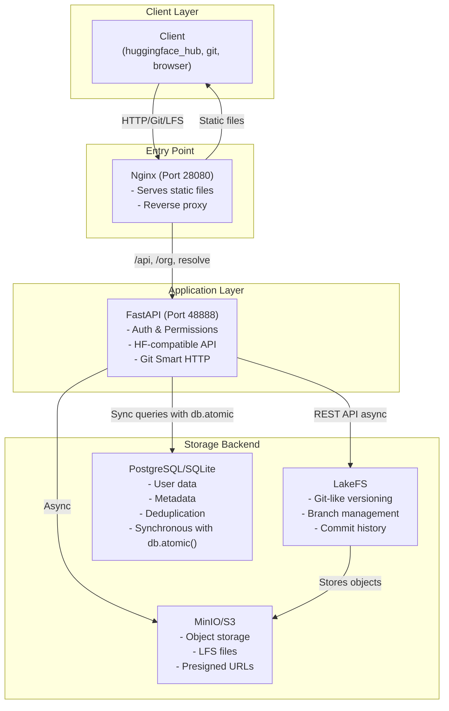
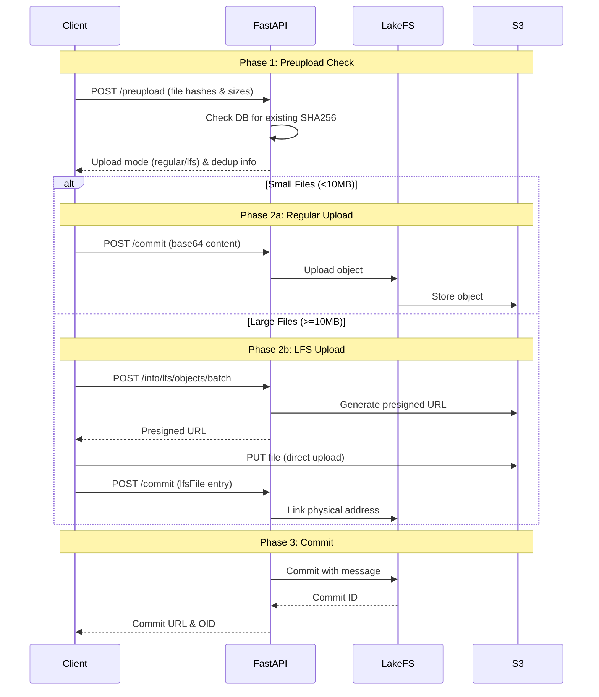
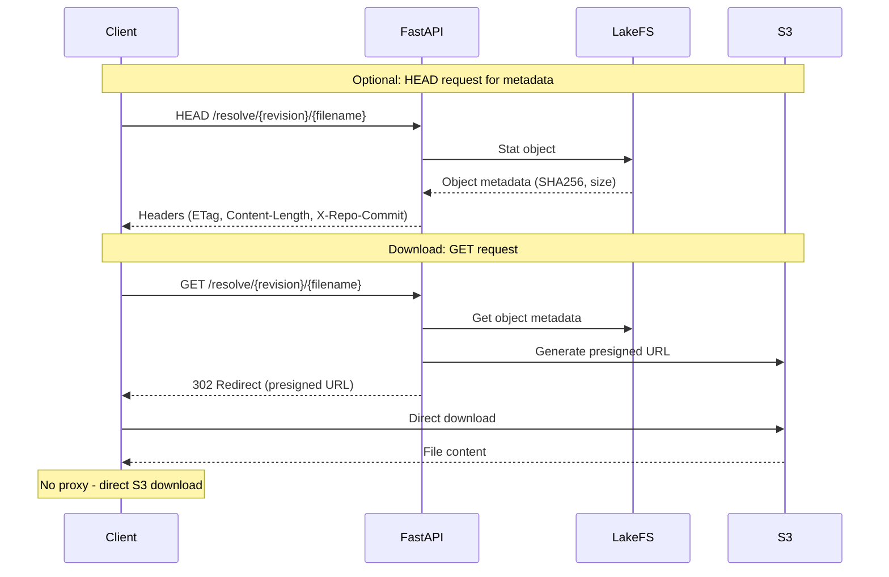
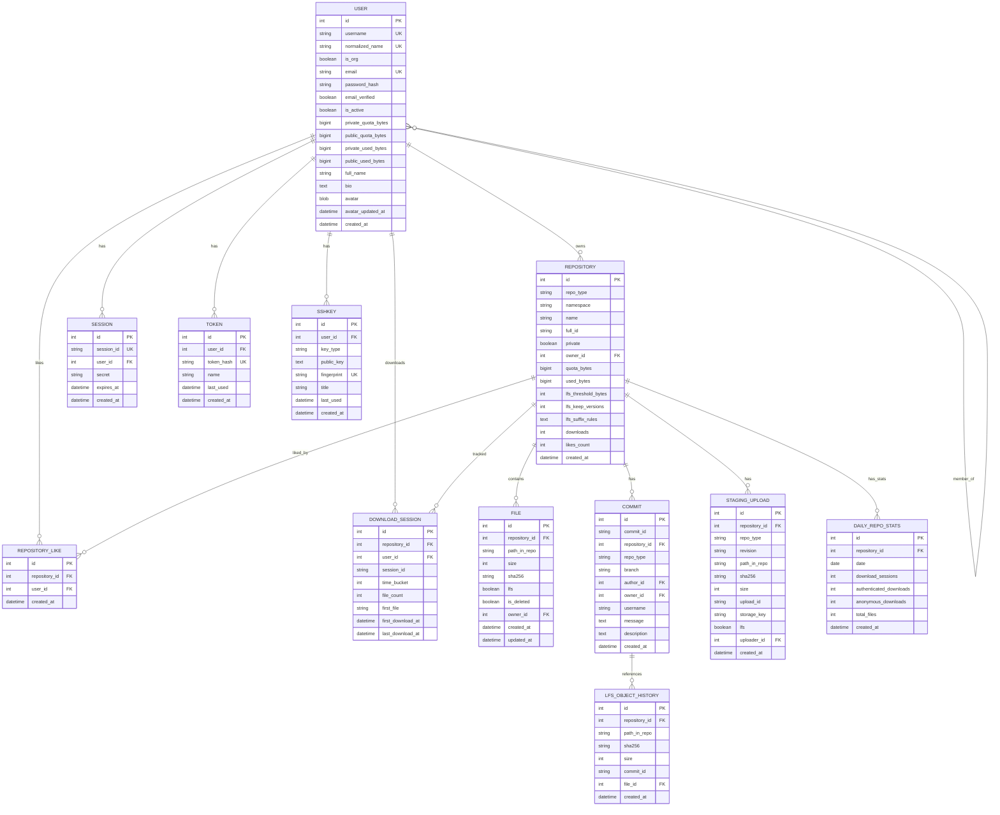

# Kohaku Hub API Documentation

*Last Updated: January 2025*

This document explains how Kohaku Hub's API works, the data flow, and all available endpoints.

## System Architecture



## Core Concepts

### File Size Thresholds


**Note:** The LFS threshold is configurable via `KOHAKU_HUB_LFS_THRESHOLD_BYTES` (default: 10MB = 10,000,000 bytes). Can also be set per-repository.

### Storage Layout

```
S3 Bucket Structure:

s3://hub-storage/
  │
  ├── hf-model-org-repo/        ← LakeFS managed repository
  │   └── main/                 ← Branch
  │       ├── config.json
  │       └── model.safetensors
  │
  └── lfs/                      ← LFS objects (content-addressable)
      └── ab/                   ← First 2 chars of SHA256
          └── cd/               ← Next 2 chars
              └── abcd1234...   ← Full SHA256 hash
```

## Upload Workflow

### Overview



### Step 1: Preupload Check

**Purpose**: Determine upload mode and check for duplicates

**Endpoint**: `POST /api/{repo_type}s/{repo_id}/preupload/{revision}`

**Request**:
```json
{
  "files": [
    {
      "path": "config.json",
      "size": 1024,
      "sha256": "abc123..."
    },
    {
      "path": "model.bin",
      "size": 52428800,
      "sha256": "def456..."
    }
  ]
}
```

**Response**:
```json
{
  "files": [
    {
      "path": "config.json",
      "uploadMode": "regular",
      "shouldIgnore": false
    },
    {
      "path": "model.bin",
      "uploadMode": "lfs",
      "shouldIgnore": true    // Already exists!
    }
  ]
}
```

### Step 2: Commit

**Purpose**: Atomically commit all changes to the repository

**Endpoint**: `POST /api/{repo_type}s/{repo_id}/commit/{revision}`

**Format**: NDJSON (Newline-Delimited JSON)

**Example Payload**:
```
{"key":"header","value":{"summary":"Add model files","description":"Initial upload"}}
{"key":"file","value":{"path":"config.json","content":"eyJtb2RlbCI6...","encoding":"base64"}}
{"key":"lfsFile","value":{"path":"model.bin","algo":"sha256","oid":"abc123...","size":52428800}}
{"key":"deletedFile","value":{"path":"old_config.json"}}
```

**Operation Types**:

| Key | Description | Usage |
|-----|-------------|-------|
| `header` | Commit metadata | Required, must be first line |
| `file` | Small file (inline base64) | For files ≤ 10MB |
| `lfsFile` | Large file (LFS reference) | For files > 10MB, already uploaded to S3 |
| `deletedFile` | Delete a single file | Remove file from repo |
| `deletedFolder` | Delete folder recursively | Remove all files in folder |
| `copyFile` | Copy file within repo | Duplicate file (deduplication-aware) |

## Download Workflow



## Database Schema



## API Endpoint Summary

### Repository Operations

| Endpoint | Method | Auth | Description |
|----------|--------|------|-------------|
| `/api/repos/create` | POST | ✓ | Create new repository |
| `/api/repos/delete` | DELETE | ✓ | Delete repository |
| `/api/repos/move` | POST | ✓ | Move/rename repository |
| `/api/{type}s` | GET | ○ | List repositories (respects privacy) |
| `/api/{type}s/{id}` | GET | ○ | Get repo info |
| `/api/{type}s/{id}/tree/{rev}/{path}` | GET | ○ | List files |
| `/api/{type}s/{id}/revision/{rev}` | GET | ○ | Get revision info |
| `/api/{type}s/{id}/paths-info/{rev}` | POST | ○ | Get info for specific paths |
| `/api/users/{username}/repos` | GET | ○ | List all repos for a user/org (grouped by type) |

### File Operations

| Endpoint | Method | Auth | Description |
|----------|--------|------|-------------|
| `/api/{type}s/{id}/preupload/{rev}` | POST | ✓ | Check before upload |
| `/api/{type}s/{id}/commit/{rev}` | POST | ✓ | Atomic commit |
| `/{id}/resolve/{rev}/{file}` | GET | ○ | Download file |
| `/{id}/resolve/{rev}/{file}` | HEAD | ○ | Get file metadata |
| `/{type}s/{id}/resolve/{rev}/{file}` | GET | ○ | Download file (with type) |
| `/{type}s/{id}/resolve/{rev}/{file}` | HEAD | ○ | Get file metadata (with type) |

### LFS Operations

| Endpoint | Method | Auth | Description |
|----------|--------|------|-------------|
| `/{id}.git/info/lfs/objects/batch` | POST | ✓ | LFS batch API |
| `/api/{id}.git/info/lfs/verify` | POST | ✓ | Verify upload |

### Commit History

| Endpoint | Method | Auth | Description |
|----------|--------|------|-------------|
| `/{type}s/{namespace}/{name}/commits/{branch}` | GET | ○ | List commits on a branch with pagination |

### Branch and Tag Management

| Endpoint | Method | Auth | Description |
|----------|--------|------|-------------|
| `/{type}s/{namespace}/{name}/branch` | POST | ✓ | Create a new branch |
| `/{type}s/{namespace}/{name}/branch/{branch}` | DELETE | ✓ | Delete a branch |
| `/{type}s/{namespace}/{name}/tag` | POST | ✓ | Create a new tag |
| `/{type}s/{namespace}/{name}/tag/{tag}` | DELETE | ✓ | Delete a tag |

### Settings Management

| Endpoint | Method | Auth | Description |
|----------|--------|------|-------------|
| `/api/users/{username}/settings` | PUT | ✓ | Update user settings |
| `/api/organizations/{org_name}/settings` | PUT | ✓ | Update organization settings |
| `/{type}s/{namespace}/{name}/settings` | PUT | ✓ | Update repository settings (private, gated, LFS settings) |
| `/api/{type}s/{namespace}/{name}/lfs/settings` | GET | ○ | Get repository LFS settings |

### Social Features

**Likes:**
| Endpoint | Method | Auth | Description |
|----------|--------|------|-------------|
| `/api/{type}s/{namespace}/{name}/like` | POST | ✓ | Like a repository |
| `/api/{type}s/{namespace}/{name}/like` | DELETE | ✓ | Unlike a repository |
| `/api/{type}s/{namespace}/{name}/like` | GET | ○ | Check if current user liked repository |
| `/api/{type}s/{namespace}/{name}/likers` | GET | ○ | List users who liked repository |
| `/api/users/{username}/likes` | GET | ○ | List repositories user has liked |

**Statistics & Trending:**
| Endpoint | Method | Auth | Description |
|----------|--------|------|-------------|
| `/api/{type}s/{namespace}/{name}/stats` | GET | ○ | Get repository statistics (downloads, likes) |
| `/api/{type}s/{namespace}/{name}/stats/recent` | GET | ○ | Get recent download statistics (time series) |
| `/api/trending` | GET | ○ | Get trending repositories |

**Avatars:**
| Endpoint | Method | Auth | Description |
|----------|--------|------|-------------|
| `/api/users/{username}/avatar` | POST | ✓ | Upload user avatar |
| `/api/users/{username}/avatar` | GET | ○ | Get user avatar image |
| `/api/users/{username}/avatar` | DELETE | ✓ | Delete user avatar |
| `/api/organizations/{org_name}/avatar` | POST | ✓ | Upload organization avatar |
| `/api/organizations/{org_name}/avatar` | GET | ○ | Get organization avatar image |
| `/api/organizations/{org_name}/avatar` | DELETE | ✓ | Delete organization avatar |

### Quota Management

| Endpoint | Method | Auth | Description |
|----------|--------|------|-------------|
| `/api/quota/{namespace}` | GET | ✓ | Get namespace quota information |
| `/api/quota/{namespace}` | PUT | ✓ | Set namespace quota |
| `/api/quota/{namespace}/recalculate` | POST | ✓ | Recalculate namespace storage usage |
| `/api/quota/{namespace}/public` | GET | ○ | Get public quota info (permission-based) |
| `/api/quota/{namespace}/repos` | GET | ✓ | List namespace repositories with storage breakdown |
| `/api/quota/repo/{type}/{namespace}/{name}` | GET | ○ | Get repository quota information |
| `/api/quota/repo/{type}/{namespace}/{name}` | PUT | ✓ | Set repository quota |
| `/api/quota/repo/{type}/{namespace}/{name}/recalculate` | POST | ✓ | Recalculate repository storage |

### Invitations

| Endpoint | Method | Auth | Description |
|----------|--------|------|-------------|
| `/api/invitations/org/{org_name}/create` | POST | ✓ | Create organization invitation |
| `/api/invitations/{token}` | GET | ✗ | Get invitation details |
| `/api/invitations/{token}/accept` | POST | ✓ | Accept invitation |
| `/api/invitations/{token}` | DELETE | ✓ | Delete/cancel invitation |
| `/api/invitations/org/{org_name}/list` | GET | ✓ | List organization invitations |

### SSH Keys

| Endpoint | Method | Auth | Description |
|----------|--------|------|-------------|
| `/api/user/keys` | GET | ✓ | List user's SSH keys |
| `/api/user/keys` | POST | ✓ | Add new SSH key |
| `/api/user/keys/{key_id}` | GET | ✓ | Get SSH key details |
| `/api/user/keys/{key_id}` | DELETE | ✓ | Delete SSH key |

### Validation

| Endpoint | Method | Auth | Description |
|----------|--------|------|-------------|
| `/api/validate/check-name` | POST | ✗ | Check if username/org/repo name is available |
| `/api/validate-yaml` | POST | ✗ | Validate YAML content |

### Authentication Operations

| Endpoint | Method | Auth | Description |
|----------|--------|------|-------------|
| `/api/auth/register` | POST | ✗ | Register new user |
| `/api/auth/login` | POST | ✗ | Login and create session |
| `/api/auth/logout` | POST | ✓ | Logout and destroy session |
| `/api/auth/verify-email` | GET | ✗ | Verify email with token |
| `/api/auth/me` | GET | ✓ | Get current user info |
| `/api/auth/tokens` | GET | ✓ | List user's API tokens |
| `/api/auth/tokens/create` | POST | ✓ | Create new API token |
| `/api/auth/tokens/{token_id}` | DELETE | ✓ | Revoke API token |

### Organization Operations

| Endpoint | Method | Auth | Description |
|----------|--------|------|-------------|
| `/org/create` | POST | ✓ | Create new organization |
| `/org/{org_name}` | GET | ✗ | Get organization details |
| `/org/{org_name}/members` | GET | ○ | List organization members |
| `/org/{org_name}/members` | POST | ✓ | Add member to organization |
| `/org/{org_name}/members/{username}` | DELETE | ✓ | Remove member from organization |
| `/org/{org_name}/members/{username}` | PUT | ✓ | Update member role |
| `/org/users/{username}/orgs` | GET | ✗ | List user's organizations |

### Git Operations

| Endpoint | Method | Auth | Description |
|----------|--------|------|-------------|
| `/{namespace}/{name}.git/info/refs` | GET | ○ | Git service advertisement |
| `/{namespace}/{name}.git/HEAD` | GET | ○ | Get HEAD reference |
| `/{namespace}/{name}.git/git-upload-pack` | POST | ○ | Clone/fetch/pull |
| `/{namespace}/{name}.git/git-receive-pack` | POST | ✓ | Push (in development) |

### Utility Operations

| Endpoint | Method | Auth | Description |
|----------|--------|------|-------------|
| `/api/whoami-v2` | GET | ✓ | Get detailed current user info |
| `/api/version` | GET | ✗ | Get API version information |
| `/health` | GET | ✗ | Health check |
| `/` | GET | ✗ | API information |

**Auth Legend**:
- ✓ = Required
- ○ = Optional (public repos)
- ✗ = Not required

---

## New Features Documentation

### Repository Likes

**Like a repository:**
```bash
POST /api/models/org/model/like
Authorization: Bearer YOUR_TOKEN
```

**Response:**
```json
{
  "success": true,
  "message": "Repository liked successfully",
  "likes_count": 42
}
```

**Check if liked:**
```bash
GET /api/models/org/model/like
```

**Response:**
```json
{
  "liked": true
}
```

**List likers:**
```bash
GET /api/models/org/model/likers?limit=50
```

**Response:**
```json
{
  "likers": [
    {
      "username": "alice",
      "full_name": "Alice Developer"
    }
  ],
  "total": 42
}
```

### Statistics and Trending

**Get repository stats:**
```bash
GET /api/models/org/model/stats
```

**Response:**
```json
{
  "downloads": 1234,
  "likes": 42
}
```

**Get recent statistics (time series):**
```bash
GET /api/models/org/model/stats/recent?days=30
```

**Response:**
```json
{
  "stats": [
    {
      "date": "2025-01-15",
      "downloads": 45,
      "authenticated": 30,
      "anonymous": 15,
      "files": 120
    }
  ],
  "period": {
    "start": "2024-12-16",
    "end": "2025-01-15",
    "days": 30
  }
}
```

**Get trending repositories:**
```bash
GET /api/trending?repo_type=model&days=7&limit=20
```

**Response:**
```json
{
  "trending": [
    {
      "id": "org/hot-model",
      "type": "model",
      "downloads": 5000,
      "likes": 200,
      "recent_downloads": 1500,
      "private": false
    }
  ],
  "period": {
    "start": "2025-01-08",
    "end": "2025-01-15",
    "days": 7
  }
}
```

### Avatar Management

**Upload avatar:**
```bash
POST /api/users/alice/avatar
Authorization: Bearer YOUR_TOKEN
Content-Type: multipart/form-data

file: [image binary data]
```

**Features:**
- Accepts JPEG, PNG, WebP, GIF
- Maximum input size: 10MB
- Automatically resizes to fit 1024x1024
- Center crops to square
- Converts to JPEG format
- Output quality: 95%

**Response:**
```json
{
  "success": true,
  "message": "Avatar uploaded successfully",
  "size_bytes": 245678
}
```

**Get avatar:**
```bash
GET /api/users/alice/avatar
```

Returns JPEG image with cache headers.

### Quota Management

**Get quota information:**
```bash
GET /api/quota/alice
Authorization: Bearer YOUR_TOKEN
```

**Response:**
```json
{
  "namespace": "alice",
  "is_organization": false,
  "quota_bytes": 10737418240,
  "used_bytes": 1234567890,
  "available_bytes": 9502850350,
  "percentage_used": 11.5
}
```

**Set quota:**
```bash
PUT /api/quota/alice
Authorization: Bearer YOUR_TOKEN
Content-Type: application/json

{
  "quota_bytes": 10737418240
}
```

**Repository-specific quota:**
```bash
GET /api/quota/repo/model/org/my-model
```

**Response:**
```json
{
  "repo_id": "org/my-model",
  "repo_type": "model",
  "namespace": "org",
  "quota_bytes": 1073741824,
  "used_bytes": 524288000,
  "available_bytes": 549453824,
  "percentage_used": 48.8,
  "effective_quota_bytes": 1073741824,
  "namespace_quota_bytes": 10737418240,
  "namespace_used_bytes": 5368709120,
  "namespace_available_bytes": 5368709120,
  "is_inheriting": false
}
```

**Storage breakdown for namespace:**
```bash
GET /api/quota/org/repos
Authorization: Bearer YOUR_TOKEN
```

**Response:**
```json
{
  "namespace": "org",
  "is_organization": true,
  "total_repos": 15,
  "repositories": [
    {
      "repo_id": "org/large-model",
      "repo_type": "model",
      "name": "large-model",
      "private": false,
      "quota_bytes": null,
      "used_bytes": 5368709120,
      "percentage_used": 50.0,
      "is_inheriting": true,
      "created_at": "2025-01-01T00:00:00Z"
    }
  ]
}
```

### Invitations

**Create organization invitation:**
```bash
POST /api/invitations/org/my-org/create
Authorization: Bearer YOUR_TOKEN
Content-Type: application/json

{
  "email": "newuser@example.com",
  "role": "member",
  "max_usage": null,
  "expires_days": 7
}
```

**Response:**
```json
{
  "success": true,
  "token": "abc123...",
  "invitation_link": "http://hub.example.com/invite/abc123...",
  "expires_at": "2025-01-22T12:00:00Z",
  "max_usage": null,
  "is_reusable": false
}
```

**Reusable invitation (10 uses):**
```json
{
  "role": "member",
  "max_usage": 10,
  "expires_days": 30
}
```

**Accept invitation:**
```bash
POST /api/invitations/{token}/accept
Authorization: Bearer YOUR_TOKEN
```

### SSH Keys

**Add SSH key:**
```bash
POST /api/user/keys
Authorization: Bearer YOUR_TOKEN
Content-Type: application/json

{
  "title": "My Laptop",
  "key": "ssh-ed25519 AAAAC3NzaC1lZDI1NTE5AAAAIB... user@host"
}
```

**Response:**
```json
{
  "id": 42,
  "title": "My Laptop",
  "key_type": "ssh-ed25519",
  "fingerprint": "SHA256:abc123...",
  "created_at": "2025-01-15T12:00:00.000000Z",
  "last_used": null
}
```

**Supported key types:**
- `ssh-rsa`
- `ssh-dss`
- `ecdsa-sha2-nistp256`
- `ecdsa-sha2-nistp384`
- `ecdsa-sha2-nistp521`
- `ssh-ed25519`

### Name Validation

**Check if name is available:**
```bash
POST /api/validate/check-name
Content-Type: application/json

{
  "name": "my-new-repo",
  "namespace": "org",
  "type": "model"
}
```

**Response (available):**
```json
{
  "available": true,
  "normalized_name": "my_new_repo",
  "conflict_with": null,
  "message": "Repository name is available"
}
```

**Response (conflict):**
```json
{
  "available": false,
  "normalized_name": "my_new_repo",
  "conflict_with": "org/My-New-Repo",
  "message": "Repository name conflicts with existing repository: My-New-Repo (case-insensitive)"
}
```

### LFS Settings

**Get repository LFS settings:**
```bash
GET /api/models/org/model/lfs/settings
```

**Response:**
```json
{
  "lfs_threshold_bytes": 5000000,
  "lfs_threshold_bytes_effective": 5000000,
  "lfs_threshold_bytes_source": "repository",
  "lfs_keep_versions": 10,
  "lfs_keep_versions_effective": 10,
  "lfs_keep_versions_source": "repository",
  "lfs_suffix_rules": [".safetensors", ".bin"],
  "lfs_suffix_rules_effective": [".safetensors", ".bin"],
  "server_defaults": {
    "lfs_threshold_bytes": 10000000,
    "lfs_keep_versions": 5
  }
}
```

**Update repository settings with LFS:**
```bash
PUT /models/org/model/settings
Authorization: Bearer YOUR_TOKEN
Content-Type: application/json

{
  "lfs_threshold_bytes": 5000000,
  "lfs_keep_versions": 10,
  "lfs_suffix_rules": [".safetensors", ".bin", ".gguf"]
}
```

## Content Deduplication

Kohaku Hub implements content-addressable storage for LFS files:

```
Same file uploaded to different repos:

Repo A: myorg/model-v1
  └─ model.bin (sha256: abc123...)

Repo B: myorg/model-v2
  └─ model.bin (sha256: abc123...)

S3 Storage:
  └─ lfs/ab/c1/abc123...  ← SINGLE COPY
         ▲          ▲
         │          │
    Repo A      Repo B
    (linked)    (linked)

Benefits:
  - Save storage space
  - Faster uploads (skip if exists)
  - Efficient for model variants
```

## Error Handling

Kohaku Hub uses HuggingFace-compatible error headers:

```
HTTP Response Headers:
  X-Error-Code: RepoNotFound
  X-Error-Message: Repository 'org/repo' not found
```

**Error Codes**:

| Code | HTTP Status | Description |
|------|-------------|-------------|
| `RepoNotFound` | 404 | Repository doesn't exist |
| `RepoExists` | 400 | Repository already exists |
| `RevisionNotFound` | 404 | Branch/commit not found |
| `EntryNotFound` | 404 | File not found |
| `GatedRepo` | 403 | Need permission |
| `BadRequest` | 400 | Invalid request |
| `ServerError` | 500 | Internal error |

These error codes are parsed by `huggingface_hub` client to raise appropriate Python exceptions.

## Performance Considerations

### Download Tracking

KohakuHub implements smart download tracking:

**Session Deduplication:**
- Downloads are grouped into 15-minute sessions
- Multiple files downloaded in the same session count as 1 download
- Uses session ID + time bucket for deduplication

**Benefits:**
- Accurate download counts (git clone = 1 download, not N file downloads)
- Trending calculations based on unique sessions
- Efficient storage (one record per session)

### Recommended S3 Providers

| Provider | Best For | Pricing Model | Notes |
|----------|----------|---------------|-------|
| Cloudflare R2 | High download | Free egress, $0.015/GB storage | Best for public datasets |
| Wasabi | Archive/backup | $6/TB/month, free egress* | *if download < storage |
| MinIO | Self-hosted | Free (your hardware/bandwidth) | Full control, privacy |
| AWS S3 | Enterprise | Pay per GB + egress | Most features, expensive egress |
| Backblaze B2 | Budget | $6/TB storage, $0.01/GB egress | Good for mixed workloads |

**Recommendation for KohakuHub:**
- **Development**: MinIO (included in docker-compose)
- **Public Hub**: Cloudflare R2 (free egress saves costs)
- **Private/Enterprise**: Self-hosted MinIO or AWS S3 with VPC endpoints
