# KohakuBoard Architecture

Deep dive into the non-blocking logging system, storage backends, and data flow.

---

## Overview

KohakuBoard uses a **multi-process architecture** with background workers to achieve zero-overhead logging during model training.

---

## High-Level Architecture

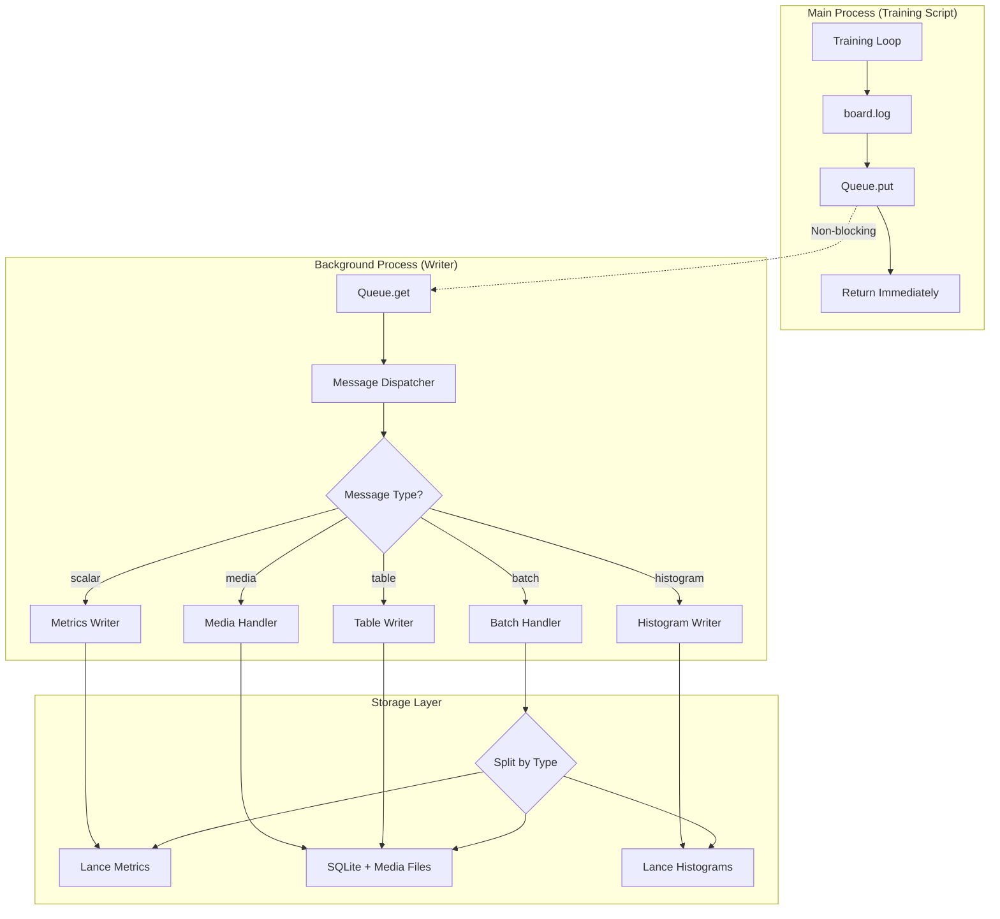

**Key Points:**
- Main process **never blocks** on disk I/O
- Queue acts as buffer (capacity: 50,000 messages)
- Background writer drains queue in batches
- All storage operations happen in background

---

## Logging Flow (Detailed)

### 1. Client-Side Logging

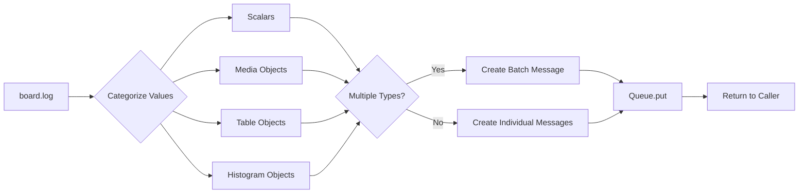

**Example - Single Type:**
```python
board.log(loss=0.5)  # Creates scalar message
```

**Example - Multiple Types (Batched):**
```python
board.log(
    loss=0.5,              # Scalar
    img=Media(...),        # Media
    hist=Histogram(...)    # Histogram
)
# Creates SINGLE batch message containing all 3 types!
```

---

### 2. Background Writer Process

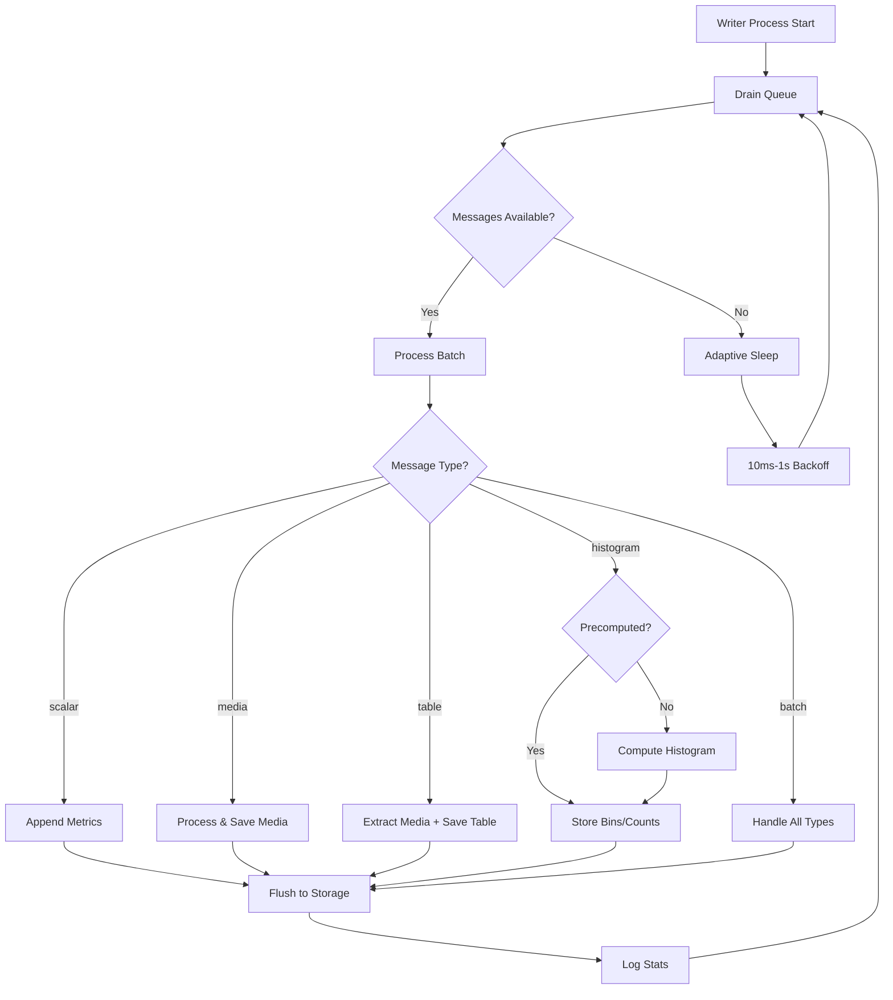

**Adaptive Batching:**
- If queue has messages: Process immediately
- If queue empty: Sleep 10ms → 20ms → 50ms → ... → 1s (exponential backoff)
- Minimizes CPU usage while maintaining low latency

---

## Storage Architecture: Hybrid Lance + SQLite

KohakuBoard uses a **hybrid storage system** combining Lance (columnar) and SQLite (row-oriented) for optimal performance. After trying various approaches including DuckDB and Parquet, we found this combination works best.

### Design Philosophy

**Reading Logs = Reading Entire Columns**

When viewing experiments, you typically read **all values** of a metric at once:
```python
# Typical read pattern
loss_values = read_metric("train/loss")
# → [0.5, 0.48, 0.45, 0.42, ...] (entire column)
```

This is a **column-oriented access pattern** → Perfect for Lance!

**Metadata = Row-Oriented Queries**

When accessing media or tables, you query **specific rows**:
```python
# Typical read pattern
media = get_media_at_step(step=100)
# → Single row with filename, dimensions, caption
```

This is a **row-oriented access pattern** → Perfect for SQLite!

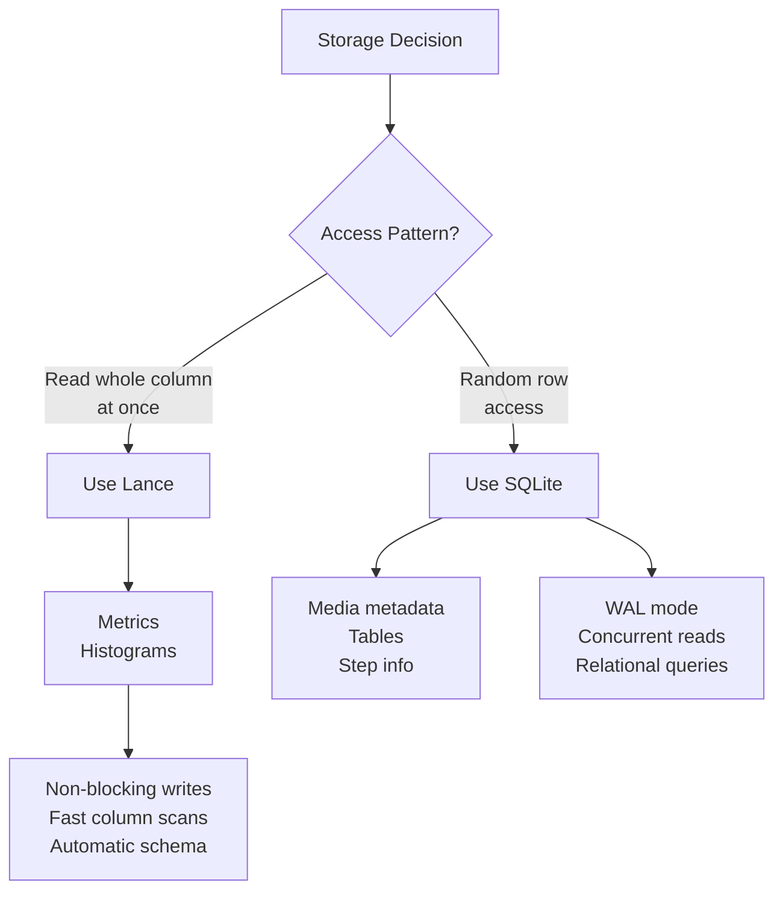

---

### Hybrid Storage Architecture

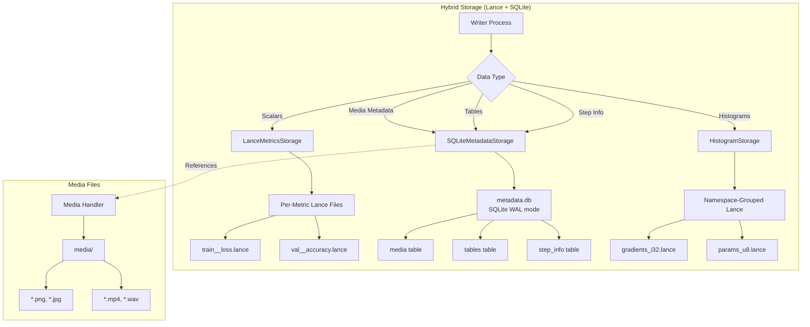

**Directory Structure:**
```
data/
├── metrics/
│   ├── train__loss.lance       # Per-metric Lance files (column-oriented)
│   ├── val__accuracy.lance
│   └── ...
├── metadata.db                 # SQLite WAL (row-oriented metadata)
│   ├── media table             # Media file references
│   ├── tables table            # Table data
│   └── step_info table         # Step timestamps
└── histograms/
    ├── gradients_i32.lance     # Namespace-grouped histograms
    ├── params_u8.lance
    └── ...
media/
├── sample_image_00000100_a1b2c3d4.png
├── training_video_00000200_e5f6g7h8.mp4
└── ...
```

---

### Why Lance for Metrics & Histograms?

**Column-Oriented Benefits:**
- ✅ **Non-blocking incremental writes:** No locks, multiple readers possible
- ✅ **Fast column reads:** Read entire metric efficiently (typical use case)
- ✅ **Automatic schema evolution:** New metrics added dynamically
- ✅ **Compression:** Efficient storage for numeric data

**Trade-offs:**
- ⚠️ NaN/Inf converted to None (Lance limitation)
- ⚠️ Not ideal for row-oriented random access

**Why we chose Lance over alternatives:**
- DuckDB: Great for SQL but had locking issues with high-frequency writes (if you want to support multiple reader you need to keep start/close connection which is slow)
- Parquet: Read-concat-write pattern too slow for real-time logging
- **Lance**: Perfect balance of write performance and read efficiency

---

### Why SQLite for Metadata?

**Row-Oriented Benefits:**
- ✅ **WAL mode = non-blocking reads:** Multiple readers don't block
- ✅ **ACID transactions:** Data integrity guaranteed
- ✅ **Perfect for metadata:** Media refs, table data, step info
- ✅ **Relational queries:** Join media to steps easily
- ✅ **Battle-tested:** Mature, reliable, zero external dependencies
- ✅ **Single file:** Easy to manage and backup

**Why SQLite over alternatives:**
- More feasible for row-oriented data than columnar formats
- Better concurrency than plain file I/O
- No server process needed (unlike PostgreSQL)
- **WAL mode is key:** Writer doesn't block readers!

---

### Performance Comparison

| Operation | Lance | SQLite | Best For |
|-----------|-------|--------|----------|
| **Sequential column read** | Fastest | Slow | Lance ✅ |
| **Random row access** | Slow | Fast | SQLite ✅ |
| **Incremental append** | Non-blocking | Single writer | Lance ✅ |
| **Concurrent reads** | Excellent | Excellent (WAL) | Both ✅ |
| **Schema evolution** | Automatic | ALTER TABLE | Lance ✅ |
| **Relational queries** | ❌ | ✅ SQL | SQLite ✅ |

**Result:** Use Lance where Lance excels, SQLite where SQLite excels!

---

### Future: LMDB for Row-Oriented Logs

**Under Consideration:** Add LMDB for row-oriented large data logging

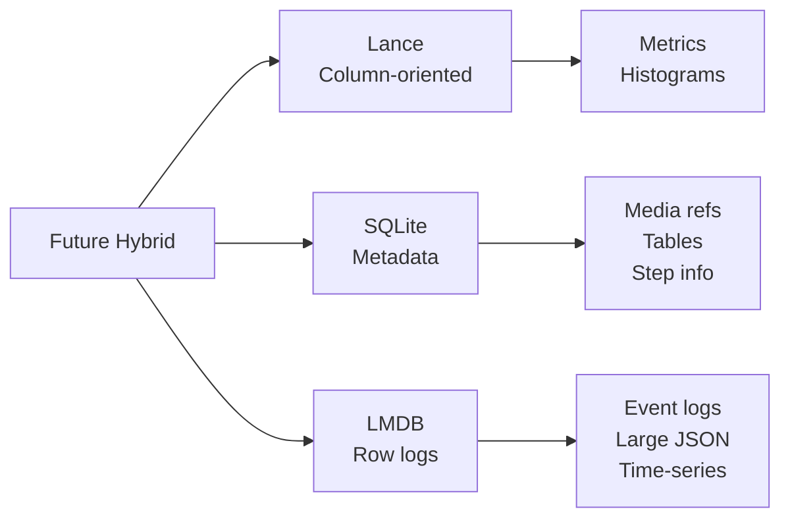

**Use Case:**
- Large JSON logs per step (not supported well by current system)
- Event-based logging (not metric time-series)
- High-frequency row inserts with fast random access

**Benefits of LMDB:**
- Zero-copy reads (memory-mapped)
- ACID transactions
- High write throughput
- No server process needed
- Excellent for key-value stores

**Status:** Under consideration, not yet implemented

---

## Message Protocol

### Message Types

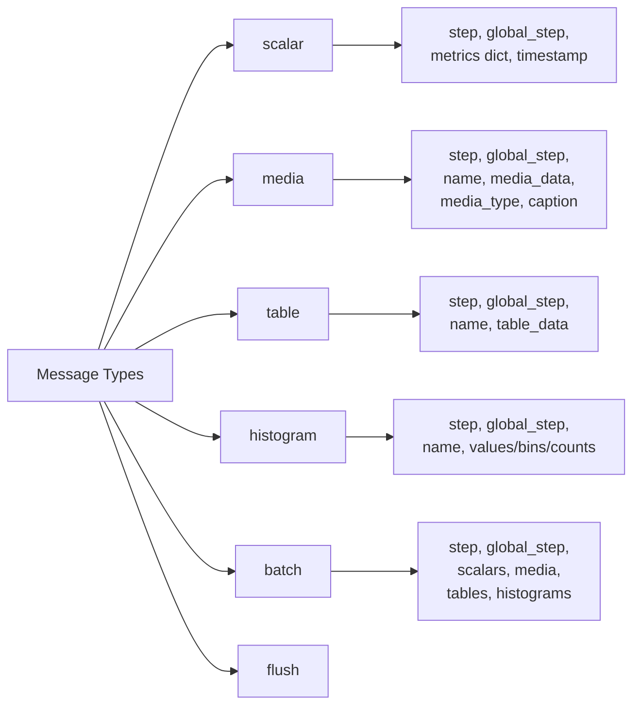

### Scalar Message

```json
{
  "type": "scalar",
  "step": 100,
  "global_step": 5,
  "metrics": {
    "train/loss": 0.5,
    "train/lr": 0.001
  },
  "timestamp": "2025-10-29T13:00:00Z"
}
```

### Batch Message (Multiple Types)

```json
{
  "type": "batch",
  "step": 100,
  "global_step": 5,
  "timestamp": "2025-10-29T13:00:00Z",
  "scalars": {
    "loss": 0.5
  },
  "media": {
    "sample_img": {
      "media_type": "image",
      "media_data": "...",
      "caption": "Sample"
    }
  },
  "tables": {
    "results": {
      "columns": ["name", "score"],
      "rows": [...]
    }
  },
  "histograms": {
    "gradients": {
      "computed": true,
      "bins": [...],
      "counts": [...]
    }
  }
}
```

---

## Histogram Optimization

### Client-Side vs Writer-Side Computation

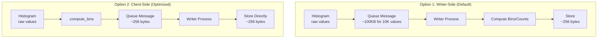

**Size Comparison:**
- Raw values: ~100KB for 10,000 values
- Precomputed bins/counts: ~256 bytes (64 bins × 4 bytes)
- **Reduction: 99.7%**

**Usage:**
```python
# Default: Send raw values
board.log(gradients=Histogram(param.grad))

# Optimized: Precompute bins
hist = Histogram(param.grad).compute_bins()
board.log(gradients=hist)
```

---

## Step Management

### Two-Level Step Tracking

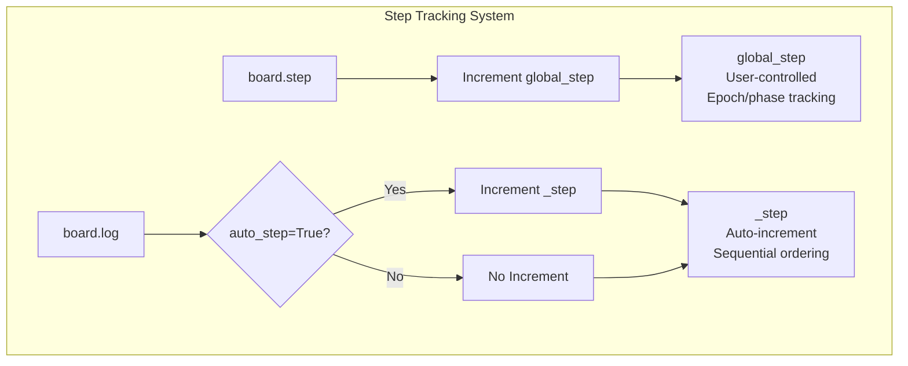

**Example:**
```python
for epoch in range(100):
    board.step()  # global_step = epoch

    for batch in train_loader:
        board.log(loss=loss)  # _step auto-increments
                             # All batches share global_step=epoch
```

**Storage:**
- Both `_step` and `global_step` stored for each log entry
- `_step`: Used for deduplication and ordering
- `global_step`: Used for charting and grouping

---

## Media Handling

### Image Processing Pipeline

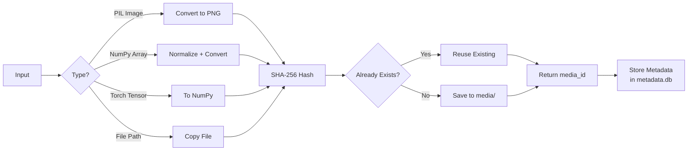

**Deduplication:**
- SHA-256 hash of image data
- If hash exists, reuse existing file
- Saves disk space for repeated images

**Filename Format:**
```
{name}_{step:08d}_{hash[:8]}.{ext}
```

Example: `sample_image_00000100_a1b2c3d4.png`

---

## Histogram Storage

### Precision Modes

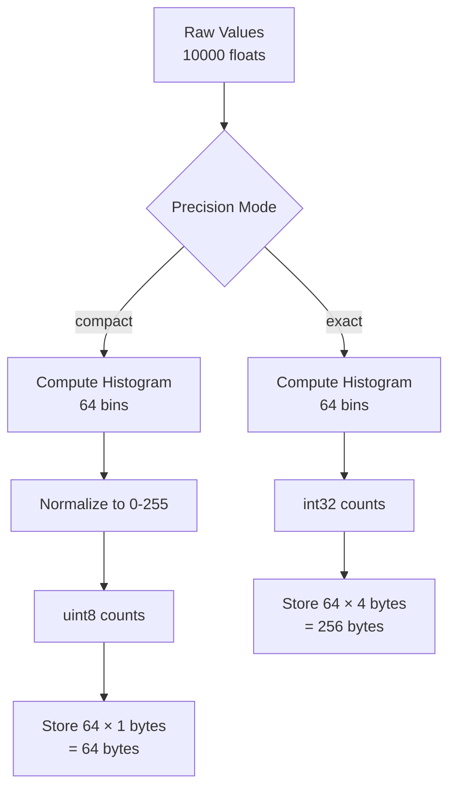

**Storage Comparison:**
- Raw values: 10,000 × 4 bytes = **40 KB**
- Exact (int32): 64 × 4 bytes = **256 bytes** (99.4% reduction)
- Compact (uint8): 64 × 1 bytes = **64 bytes** (99.8% reduction)

**Schema:**
```
step: int64
global_step: int64
name: string
counts: list<uint8 or int32>
min: float32 (p1 percentile)
max: float32 (p99 percentile)
```

---

## Queue Management

### Queue Lifecycle

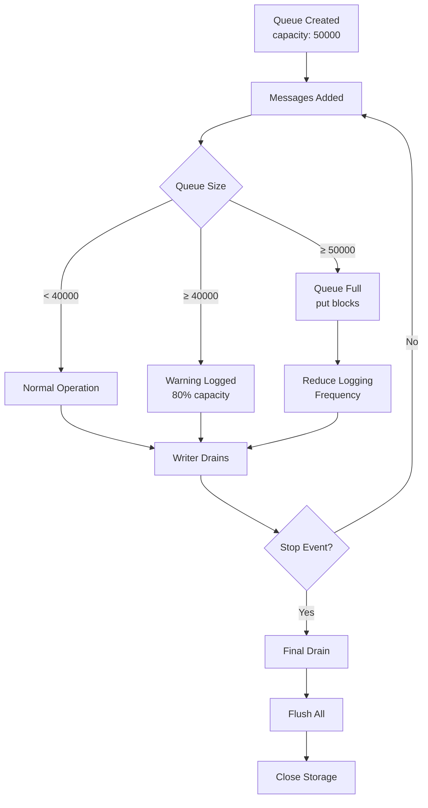

**Queue Monitoring:**
```python
# Automatic warnings
WARNING: Queue size is 40000 (80% capacity)
```

**Solutions:**
1. Reduce logging frequency (e.g., log histograms every 10 epochs instead of every epoch)
2. Precompute histograms client-side (`.compute_bins()`)
3. Use `precision="compact"` for histograms

---

## Graceful Shutdown

### Shutdown Flow

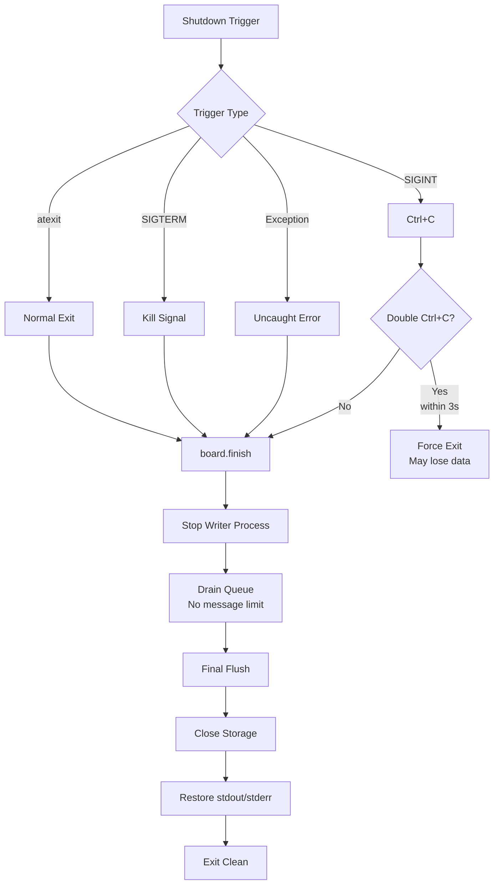

**Features:**
- ✅ `atexit` hook registers automatically
- ✅ Signal handlers for SIGINT and SIGTERM
- ✅ Double Ctrl+C for emergency exit
- ✅ Exception handler flushes before crash
- ✅ **No arbitrary limits** during final drain

---

## Performance Characteristics

### Throughput

| Operation | Time | Throughput |
|-----------|------|------------|
| `board.log(scalar)` | < 1µs | Non-blocking |
| Queue put | ~10µs | ~100,000/s |
| Writer batch (1000 metrics) | ~50ms | ~20,000/s |
| Histogram computation | ~5ms | ~200/s |
| Media save (PNG) | ~10ms | ~100/s |

### Memory Usage

| Component | Memory |
|-----------|--------|
| Queue (empty) | ~1 MB |
| Queue (40k messages) | ~50-100 MB |
| Writer process | ~100-200 MB |
| Lance writer cache | ~50 MB |
| SQLite cache | ~10 MB |

### Latency

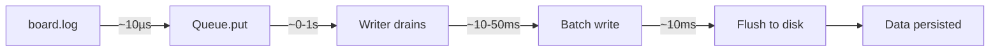

**Typical latency:**
- Log call: < 1µs (instant return)
- Queue to disk: 10ms - 1s (adaptive)
- Total: Data on disk within 1-2 seconds

---

## Best Practices

### Logging Frequency

```python
# ✅ DO: Log scalars every batch
for batch in train_loader:
    board.log(loss=loss)

# ✅ DO: Log histograms every N epochs
if epoch % 10 == 0:
    board.log(**histogram_data)

# ❌ DON'T: Log media every batch
for batch in train_loader:
    board.log(img=Media(batch[0]))  # Too frequent!
```

### Histogram Optimization

```python
# ✅ DO: Precompute if logging many histograms
hist_data = {}
for name, param in model.named_parameters():
    hist_data[f"grad/{name}"] = Histogram(param.grad).compute_bins()
board.log(**hist_data)

# ❌ DON'T: Send raw values for 100+ histograms
for name, param in model.named_parameters():
    board.log(**{f"grad/{name}": Histogram(param.grad)})  # Large queue messages!
```

### Batching

```python
# ✅ DO: Log related values together
board.log(
    loss=0.5,
    accuracy=0.95,
    sample_img=Media(img),
    results=Table(data)
)  # Single queue message!

# ❌ DON'T: Separate calls (4 messages, 4 step increments)
board.log(loss=0.5)
board.log(accuracy=0.95)
board.log(sample_img=Media(img))
board.log(results=Table(data))
```

---

## Debugging

### Enable Debug Logging

Check `logs/writer.log` for detailed timing:

```
[DEBUG] Processed and flushed 1000 metrics in 45.2ms
[DEBUG] Histogram batch: 50 histograms in 120.5ms
[DEBUG] Auto-flush completed (5000 messages processed)
```

### Queue Monitoring

```python
# Check queue size (private API, for debugging)
print(f"Queue size: {board.queue.qsize()}")
```

---

## Summary

KohakuBoard's architecture provides:

- ✅ **Non-blocking logging** via background writer
- ✅ **Hybrid storage** combining Lance (columnar) + SQLite (row-oriented)
- ✅ **Efficient batching** for mixed-type logs
- ✅ **Histogram optimization** via client-side precomputation
- ✅ **Graceful shutdown** with full queue draining
- ✅ **High throughput** (~20,000 metrics/second sustained)

The design prioritizes **training performance** (zero blocking) while maintaining **data integrity** (graceful shutdown, queue monitoring). The Lance+SQLite combination leverages each database's strengths for optimal performance.
