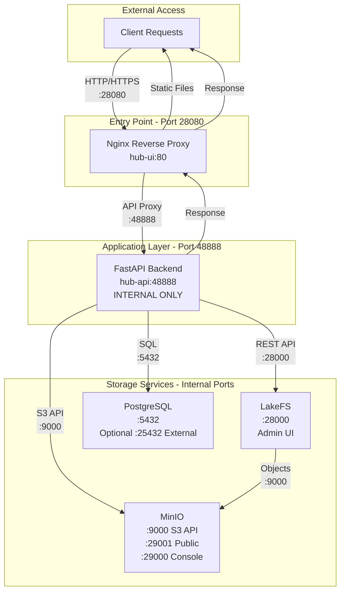

# KohakuHub Port Configuration

## Quick Reference

### For Users (Production)

**Use this port for everything:**
- **28080** - Web UI + API (nginx reverse proxy)

**Don't use:**
- ~~48888~~ - Backend API (internal only)

### For Developers

**Development:**
- **5173** - Frontend dev server (npm run dev)
- **48888** - Backend API (uvicorn)
- **48888/docs** - Swagger API documentation

**Production:**
- **28080** - All traffic (nginx → frontend + backend)

### For Admins

**Service Management:**
- **28000** - LakeFS Web UI
- **29000** - MinIO Console
- **29001** - MinIO S3 API
- **25432** - PostgreSQL (if exposed)

## Port Architecture Diagram



## Configuration Examples

### Python Client
```python
os.environ["HF_ENDPOINT"] = "http://localhost:28080"  # ✓ Correct
os.environ["HF_ENDPOINT"] = "http://localhost:48888"  # ✗ Wrong
```

### CLI
```bash
export HF_ENDPOINT=http://localhost:28080  # ✓ Correct
kohub-cli auth login
```

### Docker Compose
```yaml
# Production - Only expose port 28080
hub-ui:
  ports:
    - "28080:80"  # ✓ Only this

hub-api:
  # NO ports exposed  # ✓ Internal only
```

## Why Nginx Reverse Proxy?

1. **Single Entry Point** - One port for users to remember
2. **Security** - Backend not directly accessible
3. **SSL Termination** - Nginx handles HTTPS
4. **Static Files** - Nginx serves frontend efficiently
5. **API Proxying** - `/api`, `/org`, resolve → backend:48888
6. **Scalability** - Can add multiple backend instances

## Port Mapping

```
Client Request → Port 28080 (Nginx)
                    ├→ / (static files) → Frontend
                    ├→ /api/* → backend:48888
                    ├→ /org/* → backend:48888
                    └→ /{type}s/{ns}/{name}/resolve/* → backend:48888
```
