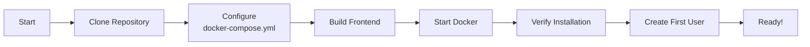
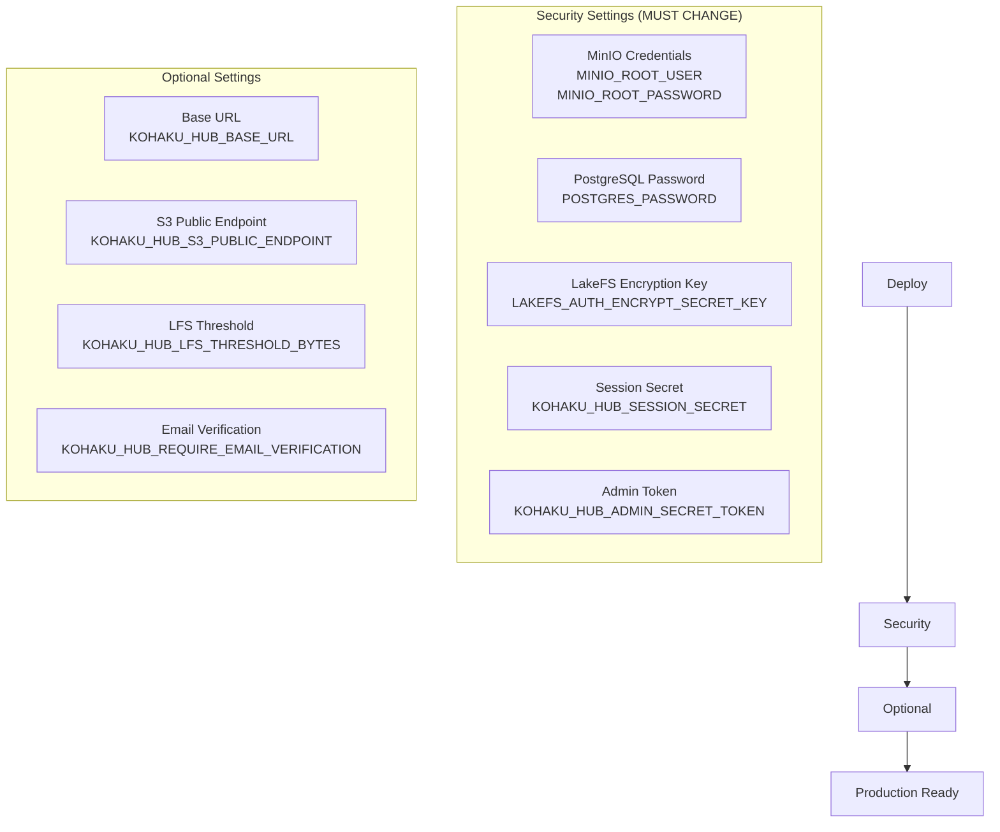

# KohakuHub Setup Guide

*Last Updated: January 2025*

## Quick Start



### 1. Clone Repository

```bash
git clone https://github.com/KohakuBlueleaf/KohakuHub.git
cd KohakuHub
```

### 2. Copy Configuration

```bash
cp docker-compose.example.yml docker-compose.yml
```

**Important:** The repository only includes `docker-compose.example.yml` as a template. You must copy it to `docker-compose.yml` and customize it for your deployment.

**Alternative:** Use the interactive generator:
```bash
python scripts/generate_docker_compose.py
```

The generator will guide you through:
- PostgreSQL setup (built-in vs external)
- LakeFS database backend
- S3 storage (MinIO vs external)
- Security key generation

### 2. Customize Configuration

**Edit `docker-compose.yml` and change these critical settings:**

#### ⚠️ Security (MUST CHANGE)

```yaml
# MinIO (Object Storage)
environment:
  - MINIO_ROOT_USER=your_secure_username        # Change from 'minioadmin'
  - MINIO_ROOT_PASSWORD=your_secure_password    # Change from 'minioadmin'

# PostgreSQL (Database)
environment:
  - POSTGRES_PASSWORD=your_secure_db_password   # Change from 'hubpass'

# LakeFS (Version Control)
environment:
  - LAKEFS_AUTH_ENCRYPT_SECRET_KEY=generate_random_32_char_key_here  # Change!

# KohakuHub API
environment:
  - KOHAKU_HUB_SESSION_SECRET=generate_random_string_here  # Change!
```

#### 🌐 Deployment URL (Optional)

If deploying to a server with a domain name:

```yaml
# KohakuHub API
environment:
  - KOHAKU_HUB_BASE_URL=https://your-domain.com        # Change from localhost
  - KOHAKU_HUB_S3_PUBLIC_ENDPOINT=https://s3.your-domain.com  # For downloads
```

### 3. Build Frontend

```bash
npm install --prefix ./src/kohaku-hub-ui
npm run build --prefix ./src/kohaku-hub-ui
```

### 4. Start Services

```bash
docker-compose up -d --build
```

### 5. Verify Installation

```bash
# Check all services are running
docker-compose ps

# View logs
docker-compose logs -f hub-api
```

### 6. Access KohakuHub

- **Web UI & API:** http://localhost:28080
- **API Docs:** http://localhost:48888/docs (optional, for development)

## Configuration Reference



### Required Changes

| Variable | Default | Change To | Why |
|----------|---------|-----------|-----|
| `MINIO_ROOT_USER` | minioadmin | your_username | Security |
| `MINIO_ROOT_PASSWORD` | minioadmin | strong_password | Security |
| `POSTGRES_PASSWORD` | hubpass | strong_password | Security |
| `LAKEFS_AUTH_ENCRYPT_SECRET_KEY` | change_this | random_32_chars | Security |
| `KOHAKU_HUB_SESSION_SECRET` | change_this | random_string | Security |
| `KOHAKU_HUB_ADMIN_SECRET_TOKEN` | change_this | random_string | Admin portal access |

**Generate secure values:**
```bash
# Generate 32-character hex key
openssl rand -hex 32

# Generate 64-character random string
openssl rand -base64 48
```

### Optional Changes

| Variable | Default | When to Change |
|----------|---------|----------------|
| `KOHAKU_HUB_BASE_URL` | http://localhost:28080 | Deploying to domain |
| `KOHAKU_HUB_S3_PUBLIC_ENDPOINT` | http://localhost:29001 | Using external S3 |
| `KOHAKU_HUB_LFS_THRESHOLD_BYTES` | 5242880 (5MB) | Adjust LFS threshold |
| `KOHAKU_HUB_REQUIRE_EMAIL_VERIFICATION` | false | Enable email verification |
| `KOHAKU_HUB_LFS_KEEP_VERSIONS` | 5 | Change version retention |
| `KOHAKU_HUB_LFS_AUTO_GC` | false | Enable auto garbage collection |
| `KOHAKU_HUB_ADMIN_ENABLED` | true | Disable admin portal |

## Post-Installation

### 1. Create First User

**Via Web UI:**
- Go to http://localhost:28080
- Click "Register"
- Create account

**Via CLI:**
```bash
pip install -e .
kohub-cli auth register
```

### 2. Get LakeFS Credentials

LakeFS credentials are auto-generated on first startup:

```bash
cat docker/hub-meta/hub-api/credentials.env
```

Use these to login to LakeFS UI at http://localhost:28000

### 3. Test with Python

```bash
pip install huggingface_hub

export HF_ENDPOINT=http://localhost:28080
export HF_TOKEN=your_token_from_ui

python scripts/test.py
```

## Troubleshooting

### Services Won't Start

**Check logs:**
```bash
docker-compose logs hub-api
docker-compose logs lakefs
docker-compose logs minio
```

**Common issues:**
- Port already in use (change ports in docker-compose.yml)
- Insufficient disk space
- Docker daemon not running

### Cannot Connect to API

**Verify nginx is running:**
```bash
docker-compose ps hub-ui
```

**Check nginx logs:**
```bash
docker-compose logs hub-ui
```

**Test directly:**
```bash
curl http://localhost:28080/api/version
```

### Cannot Access from External Network

**If deploying on a server:**

1. Update `KOHAKU_HUB_BASE_URL` to your domain
2. Update `KOHAKU_HUB_S3_PUBLIC_ENDPOINT` if using external S3
3. Add reverse proxy with HTTPS (nginx/traefik/caddy)
4. Only expose port 28080 (or 443 with HTTPS)

## Production Deployment

### 1. Use HTTPS

Add reverse proxy in front of port 28080:

```nginx
# Example nginx config
server {
    listen 443 ssl http2;
    server_name your-domain.com;

    ssl_certificate /path/to/cert.pem;
    ssl_certificate_key /path/to/key.pem;

    location / {
        proxy_pass http://localhost:28080;
        proxy_set_header Host $host;
        proxy_set_header X-Real-IP $remote_addr;
    }
}
```

### 2. Security Checklist

- [ ] Changed all default passwords
- [ ] Set strong SESSION_SECRET
- [ ] Set strong LAKEFS_AUTH_ENCRYPT_SECRET_KEY
- [ ] Using HTTPS with valid certificate
- [ ] Only port 28080 exposed (or 443 for HTTPS)
- [ ] Firewall configured
- [ ] Regular backups configured

### 3. Backup Strategy

**Data to backup:**
- `hub-meta/` - Database, LakeFS metadata, credentials
- `hub-storage/` - MinIO object storage (or use S3)
- `docker-compose.yml` - Your configuration

```bash
# Backup command
tar -czf kohakuhub-backup-$(date +%Y%m%d).tar.gz hub-meta/ hub-storage/ docker-compose.yml
```

## Updating

### Update KohakuHub

```bash
# Pull latest code
git pull

# Rebuild frontend
npm install --prefix ./src/kohaku-hub-ui
npm run build --prefix ./src/kohaku-hub-ui

# Restart services
docker-compose down
docker-compose up -d --build
```

**Note:** Check CHANGELOG for breaking changes before updating.

## Multi-Worker Deployment

For production deployments, running multiple workers improves performance and availability.

### Database Architecture

KohakuHub uses **synchronous database operations** with Peewee ORM:
- `db.atomic()` transactions ensure data consistency
- Safe for concurrent access from multiple workers
- PostgreSQL and SQLite handle connection pooling internally
- No async database wrappers needed

**Future:** Migration to peewee-async planned for better concurrency.

### Running with Multiple Workers

**Development Testing:**
```bash
# 4 workers (recommended for testing)
uvicorn kohakuhub.main:app --host 0.0.0.0 --port 48888 --workers 4

# Test with load
ab -n 1000 -c 10 http://localhost:48888/health
```

**Docker Deployment:**

Edit your `docker-compose.yml`:
```yaml
services:
  hub-api:
    image: kohakuhub-api
    command: uvicorn kohakuhub.main:app --host 0.0.0.0 --port 48888 --workers 4
    environment:
      - KOHAKU_HUB_BASE_URL=http://localhost:28080
      # ... other env vars
```

### Worker Scaling Guide

| Deployment Size | Workers | CPU Cores | Memory | Concurrent Users |
|----------------|---------|-----------|--------|------------------|
| Development | 1 | 2 | 2GB | <10 |
| Small | 2-4 | 4 | 4GB | <100 |
| Medium | 4-8 | 8 | 8GB | <1000 |
| Large | 8-16 | 16+ | 16GB+ | >1000 |

**Recommended Formula:** Workers = (2 × CPU cores) + 1

### Benefits

- **Horizontal Scaling:** Handle more concurrent requests
- **High Availability:** One worker crash doesn't affect others
- **CPU Utilization:** Leverage multiple cores efficiently
- **Load Balancing:** Uvicorn distributes requests automatically

### Limitations

- Cannot use `--reload` flag with multiple workers
- In-memory caches are per-worker (use Redis for shared cache)
- Log output from all workers (use log aggregation)

## Uninstall

```bash
# Stop and remove containers
docker-compose down

# Remove data (WARNING: This deletes everything!)
rm -rf hub-meta/ hub-storage/

# Remove docker-compose config
rm docker-compose.yml
```

## Support

- **Discord:** https://discord.gg/xWYrkyvJ2s
- **GitHub Issues:** https://github.com/KohakuBlueleaf/KohakuHub/issues
- **Documentation:** See docs/ folder
